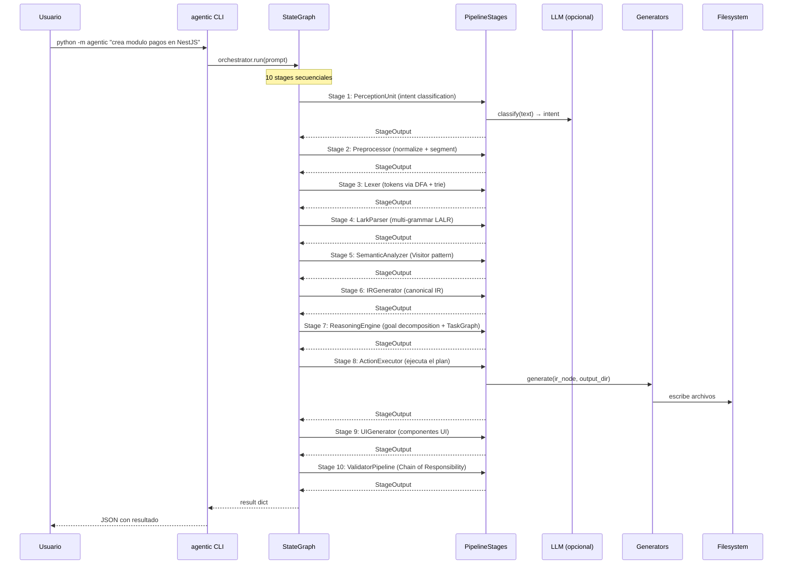
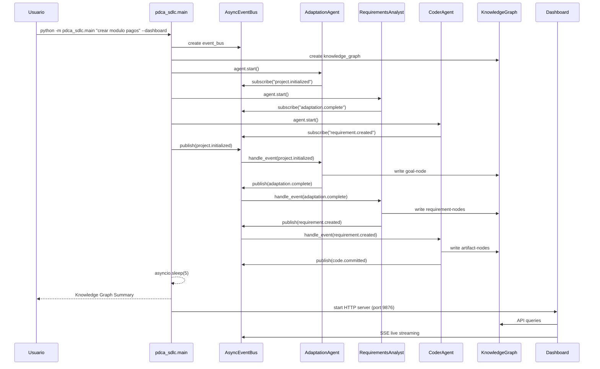

# Reporte Tecnico Exhaustivo — Proyecto0 / RECPL Compiler Bot

**Version del sistema:** 2.8.4
**Fecha del analisis:** 2026-06-20
**Alcance:** repositorio completo
**Total lineas Python:** 29,241 (233 archivos)
**Total lineas Shell:** 5,964 (45 archivos)
**Total tests:** 1,072 funciones de test (93 archivos)
**Total documentos:** 139 en `docs/`

---

## 1. Resumen Ejecutivo

### ¿Que hace el sistema?

RECPL (READ-EVAL-PRINT Compiler Loop) es un **compilador de lenguaje natural a codigo**. Toma instrucciones en espanol como *"crea un modulo de pagos en NestJS"* y genera scaffolding de modulos NestJS, entidades Prisma, componentes React, configuracion Docker, y mas.

### ¿Cual es su proposito?

Automatizar la creacion de boilerplate de proyectos software mediante un pipeline compilador clasico (Aho Dragon Book) aplicado a lenguaje natural. El sistema actua como un "compilador de requerimientos a codigo".

### ¿Que problema resuelve?

Elimina el trabajo repetitivo de crear estructura de modulos, modelos, controladores, servicios, y configuracion inicial de proyectos software. Un desarrollador describe en lenguaje natural lo que necesita y el sistema genera el scaffold completo.

### ¿Quienes son sus usuarios?

- **Desarrolladores** que usan el CLI para generar codigo NestJS/Prisma/React
- **Arquitectos** que usan el dashboard PDCA-sdlc para visualizar trazabilidad del ciclo de vida ISO 12207
- **Agentes IA** que interactuan con el sistema via pipeline compilador

---

## 2. Arquitectura General

### 2.1 Vista general

```
┌──────────────────────────────────────────────────────────────────────────┐
│                         PROYECTO0 / RECPL                                │
│                                                                          │
│  ┌──────────────────────────────────────────────────────────────────┐   │
│  │              Python v2.0 — agentic_pipeline                      │   │
│  │  ┌──────────┐  ┌──────────┐  ┌──────────┐  ┌──────────────────┐ │   │
│  │  │   CLI    │  │  State   │  │ Pipeline │  │   Observers      │ │   │
│  │  │  agentic │─→│  Graph   │─→│  Stages  │─→│ (Metrics, Audit, │ │   │
│  │  └──────────┘  │(LangGraph)│  │ (10 env.)│  │  Debug, Dash)    │ │   │
│  │                └──────────┘  └──────────┘  └──────────────────┘ │   │
│  │                                                                  │   │
│  │  ┌──────────────────────────────────────────────────────────┐   │   │
│  │  │         Generators (NestJS, Prisma, React, Docker...)    │   │   │
│  │  └──────────────────────────────────────────────────────────┘   │   │
│  └──────────────────────────────────────────────────────────────────┘   │
│                                                                          │
│  ┌──────────────────────────────────────────────────────────────────┐   │
│  │           Python v0.1 — pdca_sdlc (ISO 12207 reactive)          │   │
│  │  ┌──────────┐  ┌──────────┐  ┌──────────┐  ┌──────────────────┐ │   │
│  │  │   main   │  │  Event   │  │  Agents  │  │  Dashboard HTTP  │ │   │
│  │  │  (CLI)   │─→│   Bus    │─→│(3 agents)│─→│  (15 endpoints)  │ │   │
│  │  └──────────┘  └──────────┘  └──────────┘  └──────────────────┘ │   │
│  │  ┌──────────────────────────────────────────────────────────┐   │   │
│  │  │  KnowledgeGraph (NetworkX) + CapabilityRegistry          │   │   │
│  │  └──────────────────────────────────────────────────────────┘   │   │
│  └──────────────────────────────────────────────────────────────────┘   │
│                                                                          │
│  ┌──────────────────────────────────────────────────────────────────┐   │
│  │        Shell v1.0 — Legacy (congelado, reference code)           │   │
│  │  recpl.sh → preprocessor.sh → lexer.sh → parser.sh → semantic.sh│   │
│  │  → ir_generator.sh → synthesis.sh → scaffold.sh                  │   │
│  │  agent-robot/ (agent.sh, bridge.sh, memory.sh, 6 tools)          │   │
│  └──────────────────────────────────────────────────────────────────┘   │
└──────────────────────────────────────────────────────────────────────────┘
```

### 2.2 Modulos y capas

| Capa | Modulo | Tecnologia | Estado | Lineas |
|------|--------|-----------|--------|--------|
| Pipeline compilador | `agentic_pipeline` | Python + LangGraph | Produccion (v2.8.4) | ~15,000 |
| Orquestacion ISO 12207 | `pdca_sdlc` | Python + asyncio | Desarrollo (v0.1.0) | ~2,500 |
| CLI shell legacy | `compiler-bot/recpl.sh` | Shell script | Congelado (v1.2.0) | ~356 |
| Agente shell legacy | `compiler-bot/agent-robot` | Shell script | Congelado | ~1,500 |
| Templates scaffold | `compiler-bot/templates/` | Texto + variables | Produccion | ~10 archivos |
| Docs | `docs/` | Markdown (139 archivos) | Varios estados | ~30,000+ |

### 2.3 Comunicacion entre componentes

```
agentic (CLI)
  │
  ├── LangGraph StateGraph ──→ 10 PipelineStages secuenciales
  │     └── StageExecutor (aislamiento por error)
  │           └── PipelineStage.execute()
  │                 ├── receive_mission()
  │                 ├── analyze() → AnalysisResult
  │                 ├── reflect_and_plan() → ActionPlan
  │                 ├── act() → StageOutput
  │                 └── Observer pattern (Metrics, Audit, Debug)
  │
  ├── PromptChain (LLM chain) ──→ prompts/ (format.py, intent.py, plan.py...)
  │     └── LLMBackend → proveedores (OpenAI, Claude, mock)
  │
  ├── Dashboard HTTP (stdlib) ──→ /api/* endpoints
  │
  └── MetricsStore → SQLite | JSON fallback

pdca_sdlc (CLI)
  │
  ├── AsyncEventBus → publish/subscribe con wildcards
  │     ├── AdaptationAgent (classifica complejidad)
  │     ├── RequirementsAnalystAgent (descompone reqs)
  │     ├── CoderAgent (genera codigo)
  │     └── SSE callbacks → Dashboard live streaming
  │
  ├── KnowledgeGraph (NetworkX) → trazabilidad BFS
  ├── CapabilityRegistry → busqueda de agentes
  └── Dashboard HTTP (stdlib) ──→ 15 endpoints REST
```

### 2.4 Dependencias externas

| Dependencia | Modulo | Proposito |
|-------------|--------|-----------|
| `langgraph>=0.2.0` | agentic_pipeline | StateGraph para el pipeline de stages |
| `langchain>=0.3.0` | agentic_pipeline | Framework LLM, chains, tools |
| `langchain-openai` | agentic_pipeline | Integracion con OpenAI |
| `pydantic>=2.0` | Ambos | Validacion de datos, settings, schemas |
| `pydantic-settings` | agentic_pipeline | Configuracion via env vars |
| `lark>=1.3.0` | agentic_pipeline | Parser LALR(1) para gramaticas |
| `spacy>=3.7` | agentic_pipeline | NLP: sentence segmentation, NER |
| `sentence-transformers` | agentic_pipeline | Embeddings semanticos para clasificacion |
| `nltk>=3.8` | agentic_pipeline | Tokenization, datos linguisticos |
| `networkx>=3.0` | pdca_sdlc | Grafo de conocimiento en memoria |
| `httpx>=0.27.0` | agentic_pipeline | HTTP client para LLM API calls |
| `ruff>=0.5.0` | Dev | Linter y formateador |
| `pytest>=8.0` | Dev | Testing framework |

---

## 3. Flujo General

### 3.1 Pipeline compilador (agentic)



### 3.2 PDCA-sdlc (ISO 12207 reactivo)



---

## 4. Estructura del Proyecto

```
/home/john/proyects/proyect0/
├── compiler-bot/                        # Codigo fuente principal
│   ├── agentic                          # CLI entrypoint Python
│   ├── agentic_pipeline/               # Pipeline compilador Python v2.0
│   │   ├── orchestrator.py             # StateGraph integration
│   │   ├── state_models.py             # Modelos de datos (Pydantic)
│   │   ├── base_stage.py              # PipelineStage abstracto + Observer pattern
│   │   ├── stage_executor.py          # Error boundary por stage
│   │   ├── error_guard.py             # Estado → abort/continue
│   │   ├── config.py                  # Settings via env vars
│   │   ├── debugger.py                # 4 modos de debugging
│   │   ├── feedback_loop.py           # Feedback + metrics
│   │   ├── metrics_store.py           # SQLite/JSON persistence
│   │   ├── circuit_breaker.py         # Circuit breaker pattern
│   │   ├── optimizer.py               # Output optimization
│   │   ├── tool_registry.py           # Tool registration
│   │   ├── world_model.py            # World state snapshot
│   │   ├── memory.py                  # Agent memory
│   │   ├── contracts.py              # Stage contracts
│   │   ├── agent_loop.py             # Agent execution loop
│   │   ├── nodes/                     # 10 PipelineStages
│   │   │   ├── perception_unit.py    # Stage 1: intent classification
│   │   │   ├── preprocessor.py       # Stage 2: normalize + segment
│   │   │   ├── lexer.py              # Stage 3: DFA tokenizer + trie
│   │   │   ├── parser.py             # Stage 4: LALR parser (Lark)
│   │   │   ├── semantic_analyzer.py  # Stage 5: Visitor pattern
│   │   │   ├── ir_generator.py       # Stage 6: canonical IR
│   │   │   ├── reasoning_engine.py   # Stage 7: TaskGraph planner
│   │   │   ├── action_executor.py    # Stage 8: code generation
│   │   │   ├── ui_generator.py       # Stage 9: UI components
│   │   │   ├── validator.py          # Stage 10: Chain of Responsibility
│   │   │   ├── planner.py            # Heuristic + LLM planner
│   │   │   ├── synthesis.py          # Output synthesis
│   │   │   ├── requirement_decomposer.py
│   │   │   ├── plan_executor.py      # Plan execution
│   │   │   ├── sub_dfa.py            # DFA components for lexer
│   │   │   ├── ast_nodes.py / ast_visitor.py / ir_nodes.py / ir_builder.py
│   │   │   ├── symbol_table.py / type_systems.py
│   │   │   └── ast_cache.py          # AST cache
│   │   ├── generators/              # Code generators
│   │   │   ├── base_generator.py    # Abstract BaseGenerator + Factory
│   │   │   ├── nestjs_generator.py  # NestJS modules/controllers/services
│   │   │   ├── prisma_generator.py  # Prisma schema models
│   │   │   ├── react_generator.py   # React components
│   │   │   ├── docker_generator.py  # Dockerfile + docker-compose
│   │   │   ├── nextjs_generator.py  # Next.js pages
│   │   │   ├── tailwind_generator.py# Tailwind config
│   │   │   ├── code_formatter.py    # Code formatting
│   │   │   ├── ui_component_builder.py # UI Builder pattern
│   │   │   ├── responsive_engine.py # Responsive CSS generator
│   │   │   └── design_tokens.py     # Design tokens
│   │   ├── nlp/                     # NLP modules
│   │   │   ├── intent_classifier.py # Intention classification
│   │   │   ├── ner_extractor.py     # Named entity recognition
│   │   │   ├── slot_filler.py       # Slot filling
│   │   │   ├── ambiguity_detector.py# Ambiguity detection
│   │   │   └── enriched_input.py    # Data models (Pydantic)
│   │   ├── agents/                  # Multi-agent system (legacy)
│   │   │   ├── base_agent.py        # Abstract Agent
│   │   │   ├── perception_agent.py
│   │   │   ├── reasoning_agent.py
│   │   │   ├── execution_agent.py
│   │   │   ├── validator_agent.py
│   │   │   ├── supervisor_agent.py
│   │   │   ├── agent_mediator.py
│   │   │   ├── agent_stage_adapter.py
│   │   │   └── event_bus.py         # Sync event bus
│   │   ├── prompt_chain/            # LLM prompt chain
│   │   │   ├── orchestrator.py      # Chain orchestrator
│   │   │   ├── command_base.py      # Command pattern
│   │   │   ├── command_history.py   # Command history + replay
│   │   │   ├── commands.py          # Concrete commands
│   │   │   ├── cli.py               # CLI integration
│   │   │   ├── llm_backend.py       # LLM backend adapter
│   │   │   ├── llm_cache.py         # LLM response cache
│   │   │   ├── handler_base.py      # Base handler
│   │   │   ├── chain_context.py     # Chain context
│   │   │   ├── fallbacks.py         # Fallback strategies
│   │   │   ├── prompt_template.py   # Prompt templating
│   │   │   ├── observer_base.py     # Observer pattern
│   │   │   ├── contracts.py         # Contract validation
│   │   │   └── prompts/             # Specialized prompt files
│   │   │       ├── format.py, generate.py, intent.py, plan.py, preprocess.py, verify.py
│   │   ├── observers/              # Observer implementations
│   │   │   ├── metrics_observer.py # Performance metrics
│   │   │   ├── audit_observer.py   # Audit logging
│   │   │   ├── debug_observer.py   # Debug output
│   │   │   └── dashboard_observer.py # Dashboard updates
│   │   ├── dashboard/              # Web dashboard (stdlib)
│   │   │   ├── app.py              # HTTP server
│   │   │   ├── service.py          # Dashboard service
│   │   │   └── static/             # Frontend (vanilla JS)
│   │   ├── security/               # Security modules
│   │   ├── providers/              # LLM providers
│   │   ├── grammars/               # Lark grammar files
│   │   ├── tools/                  # Agent tools
│   │   ├── tests/                  # Python tests
│   │   └── docs/                   # MkDocs documentation
│   │
│   ├── pdca_sdlc/                  # SDLC ISO 12207 module
│   │   ├── main.py                 # CLI entrypoint
│   │   ├── core/                   # Core infrastructure
│   │   │   ├── event_bus.py        # AsyncEventBus + TopicMatcher
│   │   │   ├── knowledge_graph.py  # NetworkX-based KG
│   │   │   ├── base_agent.py       # Abstract BaseAgent
│   │   │   ├── capability_registry.py # Agent registry
│   │   │   └── llm_client.py       # Mock LLM client
│   │   ├── agents/                 # SDLC agents
│   │   │   ├── adaptation_agent.py     # Complexity + lifecycle
│   │   │   ├── requirements_analyst.py # Requirement decomposition
│   │   │   └── coder_agent.py         # Code generation
│   │   ├── protocols/              # Event schemas (Pydantic)
│   │   │   └── event_schemas.py    # 8 event models
│   │   ├── dashboard/              # Dashboard HTTP server
│   │   │   ├── app.py              # 15 endpoints
│   │   │   ├── service.py          # Read facade
│   │   │   └── static/             # Vanilla JS frontend
│   │   └── tests/                  # 14 test files, 224 tests
│   │
│   ├── recpl.sh                    # Shell LOOP principal (v1.2.0)
│   ├── frontend/                   # Shell pipeline frontend
│   │   ├── preprocessor.sh         # Preprocessor
│   │   ├── lexer.sh                # DFA Lexer
│   │   ├── parser.sh               # LL(1) Recursive Descent
│   │   └── semantic.sh             # Semantic + symbol table
│   ├── middleend/                  # Shell pipeline middle-end
│   │   └── ir_generator.sh         # IR generation
│   ├── backend/                    # Shell pipeline back-end
│   │   ├── synthesis.sh            # Bot response
│   │   └── scaffold.sh             # Template rendering
│   ├── agent-robot/                # Shell agent layer
│   │   ├── agent.sh                # Agent main loop
│   │   ├── bridge.sh               # RECPL bridge
│   │   ├── memory.sh               # Persistent memory
│   │   ├── planner.sh              # Multi-step planner
│   │   ├── config.sh               # Environment config
│   │   ├── agent-robot.sh          # Global entrypoint
│   │   ├── tools/                  # 6 tool scripts
│   │   ├── providers/              # LLM providers
│   │   └── prompts/                # System prompts
│   ├── templates/                  # Scaffold templates
│   │   ├── module-nestjs/         # NestJS module template
│   │   ├── entity-nestjs/         # NestJS entity template
│   │   └── module-prisma/         # Prisma model template
│   └── tests/                      # Shell tests
│       ├── run_tests.sh            # 72 tests
│       └── test_agent.sh           # 13 agent tests
│
├── docs/                           # 139 documentos de documentacion
│   ├── 001-178.md                  # Documentos numerados secuencialmente
│   ├── algorithms/                 # Algoritmos y planes
│   ├── api/                        # Documentacion de API
│   ├── architecture/               # Documentacion arquitectonica
│   ├── dev/                        # Guias de desarrollo
│   ├── mgt/                        # Reportes de gestion
│   ├── onboarding/                 # Guias de onboarding
│   └── ...
│
├── scripts/                        # Shell scripts de operacion
│   ├── daily_check.sh              # Daily smoke test
│   ├── release_check.sh            # Release gate
│   ├── check_version_alignment.sh  # Version check
│   ├── pipeline_stats.sh           # Pipeline metrics
│   ├── generate_docs_index.sh      # Doc index generation
│   └── demo.sh                     # Demo runner
│
├── .github/workflows/ci.yml        # GitHub Actions CI
├── .pre-commit-config.yaml         # Pre-commit hooks
├── Dockerfile + docker-compose.yml # Container support
├── mkdocs.yml                      # Documentation site config
├── VERSION                         # 2.8.4
├── CHANGELOG.md                    # Changelog (Keep a Changelog)
└── README.md                       # Project README
```

---

## 5. Componentes Principales

### 5.1 AgentOrchestrator (`orchestrator.py`)

| Aspecto | Descripcion |
|---------|-------------|
| **Funcion** | Coordina los 10 PipelineStages via LangGraph StateGraph |
| **Responsabilidades** | Construir el grafo, conectar stages secuencialmente, manejar errores via ErrorGuard |
| **Dependencias** | `langgraph`, `StageExecutor`, `ErrorGuard`, todos los `PipelineStage` |
| **Punto de entrada** | `run(user_input)` → `compiled.ainvoke(ctx)` |
| **Punto de salida** | Diccionario con `{"output": ..., "success": True}` |
| **Patron** | StateGraph (LangGraph) secuencial con conditional_edges |
| **Archivo** | `compiler-bot/agentic_pipeline/orchestrator.py:91` |

La classe `AgentOrchestrator` (alias `PipelineOrchestrator`) construye un `StateGraph(StageContext)` con 10 nodos, cada uno envuelto en un `StageExecutor` que captura excepciones. Las aristas condicionales usan `ErrorGuard.should_continue()` para abortar el pipeline si `last_error` esta definido.

Tambien proporciona `PipelineMacroCommand` que ejecuta los mismos stages como un `Command` (patron Command), permitiendo uso con `CommandHistory`, logging, y replay.

### 5.2 PipelineStage (`base_stage.py`)

| Aspecto | Descripcion |
|---------|-------------|
| **Funcion** | Clase base abstracta para todos los stages del pipeline |
| **Responsabilidades** | Ciclo analyze → plan → act, notificacion a observers, validacion de contratos |
| **Dependencias** | `StageSubject` (Observer), `STAGE_CONTRACTS` |
| **Punto de entrada** | `execute(input_data)` |
| **Punto de salida** | `StageOutput` con output_data, metrics, feedback, success flag |
| **Patron** | Template Method + Observer + Strategy |

```python
class PipelineStage(Analyzable, Plannable, Executable, ABC):
    subject: StageSubject = StageSubject()  # compartido globalmente
    
    def execute(self, input_data) -> StageOutput:
        self.receive_mission(input_data)
        analysis = self.analyze()          # → AnalysisResult
        plan = self.reflect_and_plan(analysis)  # → ActionPlan
        output = self.act(plan)            # → StageOutput
        # validacion de contrato
        # notificacion a observers
        self.learn_and_improve(output.feedback)
        return output
```

Observers default adjuntos globalmente: `MetricsObserver` + `AuditObserver`.

### 5.3 AsyncEventBus (`pdca_sdlc/core/event_bus.py`)

| Aspecto | Descripcion |
|---------|-------------|
| **Funcion** | Bus de eventos asincrono con topicos jerarquicos y wildcards |
| **Responsabilidades** | publish/subscribe, wildcard matching, secuencias por proyecto, log FIFO circular, indices, SSE callbacks |
| **Dependencias** | `agentic_pipeline.agents.event_bus.EventBus` (inner bus) |
| **Punto de entrada** | `publish(event)`, `subscribe(topic, handler)` |
| **Punto de salida** | `query_events()`, `replay()`, `get_event()`, `get_stats()`, SSE callbacks |
| **Patron** | Observer + Mediator |

Soporta wildcards: `*` (un nivel), `>` (subarbol). Mantiene:
- `_event_log`: lista FIFO circular (max 10000)
- `_by_project`: indice por proyecto
- `_by_id`: indice por ID de evento
- `_sequences`: contadores por proyecto

### 5.4 KnowledgeGraph (`pdca_sdlc/core/knowledge_graph.py`)

| Aspecto | Descripcion |
|---------|-------------|
| **Funcion** | Grafo de conocimiento en memoria para trazabilidad |
| **Responsabilidades** | CRUD de nodos y aristas, query por tipo/propiedades, trazabilidad BFS |
| **Dependencias** | `networkx` (DiGraph) |
| **Punto de entrada** | `add_node()`, `add_edge()`, `query()` |
| **Punto de salida** | `get_trace()` (BFS), `all_nodes()`, `node_count()` |
| **Patron** | Graph (NetworkX) |

Tipos de nodo (`NodeType`): `requirement`, `component`, `code_module`, `architecture_decision`, `goal`, `risk`, `artifact`, `task`, `milestone`.

### 5.5 Generators (`generators/`)

Cada generador implementa `BaseGenerator.generate(ir_node, output_dir) → list[Path]`:

| Generador | Target | Archivos que produce |
|-----------|--------|---------------------|
| `NestJSGenerator` | nestjs | `*.controller.ts`, `*.service.ts`, `*.module.ts`, `*.entity.ts` |
| `PrismaGenerator` | prisma | `*.prisma` models |
| `ReactGenerator` | react | `*.tsx` pages y componentes |
| `DockerGenerator` | docker | `Dockerfile`, `docker-compose.yml` |
| `NextJSGenerator` | nextjs | Next.js pages |
| `TailwindGenerator` | tailwind | `tailwind.config.js` |

### 5.6 Dashboard HTTP (pdca_sdlc)

Servidor HTTP zero-dependency usando `http.server` stdlib, 15 endpoints REST + SSE + frontend vanilla JS.

| Componente | Archivo | Responsabilidad |
|------------|---------|-----------------|
| `DashboardHTTPHandler` | `app.py` | Rutas HTTP, JSON responses, SSE streaming |
| `SdlcDashboardService` | `service.py` | Fachada read-only sobre KG + EventBus + Registry |
| Frontend | `static/` | SPA con Canvas chart, SVG timeline, modal, SSE consumer |

### 5.7 Shell RECPL v1.0

Pipeline CLI shell con 6 stages conectados via pipes UNIX:

```
INPUT → preprocessor.sh → lexer.sh → parser.sh → semantic.sh → ir_generator.sh → synthesis.sh → OUTPUT
```

Mas el LOOP principal `recpl.sh` y la capa agente `agent-robot/`.

---

## 6. Feature Inventory

### 6.1 Pipeline compilador (agentic_pipeline)

| Feature | Descripcion | Archivos | Servicios |
|---------|-------------|----------|-----------|
| Clasificacion de intencion | Detecta la intencion del usuario mediante embeddings semanticos | `perception_unit.py` | SentenceTransformer, LLM |
| Preprocesamiento | Normaliza, segmenta y enriquece el texto de entrada | `preprocessor.py` | Spacy, EmbeddingEnricher |
| Analisis lexico | Tokeniza usando DFA con maximal munch + trie multi-palabra | `lexer.py`, `sub_dfa.py` | TokenFlyweightRegistry |
| Parsing LALR(1) | Multi-gramatica con Lark, resolucion de ambiguedades | `parser.py` | Lark, NLTK |
| Analisis semantico | Visitor pattern sobre AST, validacion de tipos | `semantic_analyzer.py` | ASTVisitor, SymbolTable |
| Generacion IR | AST → Representacion Intermedia canonica | `ir_generator.py`, `ir_builder.py`, `ir_nodes.py` | — |
| Planificador | Goal decomposition + TaskGraph topologico + HeuristicPlanner | `reasoning_engine.py`, `planner.py`, `plan_executor.py` | LLM |
| Ejecucion | Genera codigo via generadores desde el plan/IR | `action_executor.py` | GeneratorFactory |
| Generacion UI | Componentes UI con Builder pattern, responsive engine, accesibilidad | `ui_generator.py`, `ui_component_builder.py`, `responsive_engine.py` | DesignTokens |
| Validacion | Chain of Responsibility: SyntaxValidator → TypeChecker → SecurityScanner | `validator.py` | — |
| Prompt chain | Cadena de prompts LLM con command history, cache, fallbacks | `prompt_chain/` | LLMBackend, LLMCache |
| Debugging | 4 modos: trace, step, timing, inspect | `debugger.py` | — |
| Feedback loop | Metricas historicas, prompt chain stats, persistencia SQLite/JSON | `feedback_loop.py`, `metrics_store.py` | sqlite3 |
| Dashboard web | Servidor HTTP stdlib con 5 endpoints + UI estatica | `dashboard/` | MetricsStore |
| Circuit breaker | Proteccion contra fallos repetidos | `circuit_breaker.py` | — |
| Pipeline macro | Pipeline completo como Command (Command pattern) | `orchestrator.py` (PipelineMacroCommand) | CommandHistory |

### 6.2 Orquestacion SDLC (pdca_sdlc)

| Feature | Descripcion | Archivos | Servicios |
|---------|-------------|----------|-----------|
| AsyncEventBus | Bus de eventos async con wildcards, indices, SSE callbacks | `core/event_bus.py` | Inner EventBus |
| KnowledgeGraph | Grafo de trazabilidad NetworkX con BFS | `core/knowledge_graph.py` | NetworkX |
| CapabilityRegistry | Registro central de capacidades de agentes | `core/capability_registry.py` | — |
| LLMClient | Cliente LLM con retry, fallbacks, modo mock | `core/llm_client.py` | — |
| BaseAgent | Ciclo de vida agente: start → handle_event → stop | `core/base_agent.py` | EventBus, KG, Registry |
| Clasificacion de complejidad | Classifica proyecto como simple/moderate/complex | `agents/adaptation_agent.py` | LLMClient, heuristics |
| Descomposicion de reqs | Descompone descripcion en requisitos estructurados | `agents/requirements_analyst.py` | LLMClient, heuristics |
| Generacion de codigo | Mapea reqs a targets y genera codigo via agentic_pipeline generators | `agents/coder_agent.py` | GeneratorFactory |
| Dashboard REST | 15 endpoints REST + SSE live streaming | `dashboard/app.py`, `service.py` | KG, EventBus, Registry |
| Frontend SPA | Canvas chart, SVG timeline, explorador, modal, SSE consumer | `dashboard/static/` | — |

### 6.3 Shell v1.0 (legacy)

| Feature | Descripcion | Archivos |
|---------|-------------|----------|
| Preprocesador | Trim, lowercase, NFKD, remove punct, split sentences | `frontend/preprocessor.sh` |
| Lexer DFA | Tokenizacion con maximal munch, tokens: ACTION, MODULE, ENTITY, TECH | `frontend/lexer.sh` |
| Parser LL(1) | Recursive descent, BNF grammar con manejo de errores | `frontend/parser.sh` |
| Analisis semantico | Symbol table persistente, type checking | `frontend/semantic.sh` |
| IR generator | AST + symbol table → IR.json canonico | `middleend/ir_generator.sh` |
| Synthesis | IR.json → respuesta del bot (accion, mensaje, payload) | `backend/synthesis.sh` |
| Scaffold | Template rendering con sustitucion de variables | `backend/scaffold.sh` |
| Agent shell | Clasifica intencion, enruta a tools (RECPL, read, write, run, search) | `agent-robot/agent.sh` |
| Memoria persistente | JSON-based multi-session memory | `agent-robot/memory.sh` |
| Planificador | Multi-step plan decomposer | `agent-robot/planner.sh` |
| Bridge RECPL | Unidirectional bridge agent → RECPL | `agent-robot/bridge.sh` |

---

## 7. Flujo de Datos

### 7.1 Datos a traves del pipeline Python

```
INPUT: string (lenguaje natural)
  │
  ▼
PerceptionUnit
  ├── SentenceTransformerClassifier.classify() → (intent, confidence)
  └── output: dict con intent, confidence, raw_text
  │
  ▼
Preprocessor
  ├── NormalizationFilter: lowercase, trim, NFKD, collapse punct
  ├── SegmentationFilter: split sentences
  ├── EmbeddingEnricher: sentence-transformers embeddings
  └── output: dict con text, enriched_text, embeddings, language
  │
  ▼
Lexer
  ├── MultiWordTrie: lookup multi-word phrases
  ├── DFA tokenizer: single-word tokens via regex
  └── output: list[Token] con value, type, category, position, confidence
  │
  ▼
LarkParser (multi-grammar)
  ├── _select_grammar() → project | page | module | data | infra
  ├── Lark LALR(1) parse
  └── output: AST (ProjectNode, PageNode, ComponentNode, EntityNode...)
  │
  ▼
SemanticAnalyzer
  ├── SemanticAnalysisVisitor (walk AST)
  ├── SymbolTable: add/check duplicates
  ├── TypeSystems: validate types
  └── output: AST validado + symbol_table + errors
  │
  ▼
IRGenerator
  ├── IRBuilder: AST → IR canonical nodes
  ├── IRSerializer: IR → JSON
  └── output: IR.json con actions, modules, entities, tech_stack, trace
  │
  ▼
ReasoningEngine
  ├── GoalTreePlanner: decompose goal → TaskGraph
  ├── Topological sort (DAG)
  ├── HeuristicPlanner: group by layer, estimate complexity
  └── output: TaskGraph with ordered tasks + plans
  │
  ▼
ActionExecutor
  ├── GeneratorFactory.get_generator(target)
  ├── generator.generate(ir_node, output_dir)
  └── output: paths de archivos generados
  │
  ▼
UIGenerator
  ├── ComponentFactory: form/table/modal/card builders
  ├── ResponsiveEngine: CSS classes
  ├── AccessibilityInjector, AnimationInjector
  └── output: UI component tree + CSS + TSX
  │
  ▼
ValidatorPipeline (Chain of Responsibility)
  ├── SyntaxValidator: check file syntax (tsc, prisma validate)
  ├── TypeChecker: cross-file type consistency
  ├── SecurityScanner: secrets, SQL injection, XSS patterns
  └── output: ValidationResult con errors, warnings, summary
  │
  ▼
OUTPUT: dict con resultado final, archivos generados, metricas
```

### 7.2 Datos a traves del pipeline Shell

```
INPUT: string (ej: "crea modulo payments en nestjs")
  │
  ▼ preprocessor.sh
  ├── trim → NFKD normalize → lowercase → collapse punct → split sentences
  └── stdout: "crea modulo payments en nestjs"
  │
  ▼ lexer.sh (stdin pipe)
  ├── DFA con maximal munch, awk_match_prefix()
  ├── Tokens: ACTION_CREATE, MODULE, ENTITY, TECH_NESTJS, PREP_IN
  └── stdout (JSONL): {"type":"ACTION_CREATE","lexeme":"crea",...}
       {"type":"MODULE","lexeme":"modulo",...}
       {"type":"ENTITY","lexeme":"payments",...}
       {"type":"PREP_IN","lexeme":"en",...}
       {"type":"TECH_NESTJS","lexeme":"nestjs",...}
  │
  ▼ parser.sh (stdin pipe)
  ├── LL(1) recursive descent
  ├── BNF: comando → accion modulo_espec opcional_tech
  └── stdout (JSON): {"tipo":"Comando","accion":"CREATE",...}
  │
  ▼ semantic.sh (stdin pipe)
  ├── Symbol table: hash file (persistente via RECPL_STATE_DIR)
  ├── Type checking: tech stack soportado? entidad existe?
  └── stdout (JSON): {"ast":{...},"symbol_table":{...}}
  │
  ▼ ir_generator.sh (stdin pipe)
  ├── Extrae accion, tipo, params, tech del AST
  ├── Mapea a IR canonico
  └── stdout (JSONL): IR.json
  │
  ▼ synthesis.sh (stdin pipe)
  ├── IR → mensaje bot + payload accion
  └── stdout (JSON): {"tipo_respuesta":"action","mensaje":"...","payload":{...}}
  
  OUTPUT: JSON con respuesta del bot
```

---

## 8. Modelo de Datos

### 8.1 Entidades Pydantic (agentic_pipeline)

**StageContext** — Contexto de ejecucion del pipeline (frozen):
```
mission_id: str        # auto: datetime.isoformat()
stage: Stage           # enum: INTENT, PREPROCESSOR, LEXER...
input_data: Any
previous_output: Any | None
config_overrides: dict
last_error: str | None
```

**StageOutput** — Salida de cada stage:
```
stage: Stage
output_data: Any
metrics: dict
feedback: dict
success: bool
error: str | None
```

**Token** — Token del lexer:
```
value: str
type: str
category: str
position: int
confidence: float
context: dict
```

**Stage (Enum)** — 14 valores posibles:
```
INTENT, PERCEPTION, REQUIREMENT_DECOMPOSER, PREPROCESSOR, LEXER, PARSER,
SEMANTIC_ANALYZER, IR_GENERATOR, PLANNER, REASONING, SYNTHESIS, EXECUTION,
UI_GENERATOR, VALIDATOR
```

**NLP models** (`nlp/enriched_input.py`):
```
IntentResult: intent, domain, confidence, raw_text
Entity: name, type, value, position, confidence
Entities: technology, modules, requirements
Slots: type, name, tech
EnrichedInput: text, intent, entities, slots, embeddings, context, ambiguity
```

### 8.2 Entidades (pdca_sdlc)

**Event** — Evento del bus:
```
topic: str
source: str
project_id: str
data: dict
id: str                    # auto: uuid4 hex[:12]
timestamp: float           # auto: time.time()
sequence: int              # auto-increment por proyecto
```

**Node** — Nodo del grafo de conocimiento:
```
id: str
node_type: NodeType        # enum: requirement, goal, artifact, risk...
properties: dict
created_by: str
created_at: float
```

**Edge** — Arista del grafo:
```
source_id: str
target_id: str
edge_type: EdgeType        # enum: satisfies, implements, verifies...
properties: dict
```

**CapabilityManifest** — Manifiesto de agente:
```
agent_id: str
agent_name: str
description: str
iso_12207: dict
triggers: list[str]
output_events: list[str]
llm_profile: str
version: str
status: str
```

### 8.3 Event Schemas (Pydantic — `protocols/event_schemas.py`)

| Schema | Topic | Campos clave |
|--------|-------|-------------|
| `ProjectInitialized` | `project.initialized` | description, project_id |
| `AdaptationComplete` | `adaptation.complete` | complexity, lifecycle, processes, activities, effort_estimate |
| `RequirementCreated` | `requirement.created` | requirement_ids, count |
| `ArchitectureProposed` | `architecture.proposed` | component_ids, components, requirement_ids |
| `CodeCommitted` | `code.committed` | module_id, component, files, tests_passed |
| `CodeFailed` | `code.failed` | module_id, component, error |
| `QualityGateResult` | `quality_gate.result` | module_id, gate, result, details |
| `RiskIdentified` | `risk.identified` | description, severity, source_event |

### 8.4 Relaciones entre entidades (pdca_sdlc)

```
Project (descrito por texto)
  │
  ├── Goal (nodo KG, tipo: goal, 1 por proyecto)
  │     ├── complexity: simple|moderate|complex
  │     ├── lifecycle: fast_track|iterative|agile
  │     └── effort_estimate: {hours, days}
  │
  ├── Requirements (nodos KG, tipo: requirement, N por proyecto)
  │     ├── text, type, priority, acceptance_criteria
  │     └── relacionados via Edge: satisfies → Goal
  │
  └── Artifacts (nodos KG, tipo: artifact, N por proyecto)
        ├── target: nestjs|prisma|docker
        ├── status: committed|failed
        └── files: [paths]
        
Event Bus (log temporal)
  ├── project.initialized (1 por proyecto)
  ├── adaptation.complete (1 por proyecto)
  ├── requirement.created (1 por lote de reqs)
  ├── code.committed (1 por target)
  └── risk.identified (0+ ante errores)
```

### 8.5 Metricas (feedback_loop.py + metrics_store.py)

```
MetricsRecord:
  stage: str           # nombre del stage
  duration: float      # segundos
  success: bool
  error: str | None
  output_size: int
  timestamp: float

PromptChainRecord:
  stage: str
  prompt: str
  response: str
  model: str
  tokens_in: int
  tokens_out: int
  duration: float
  success: bool
  fallback_used: bool
```

---

## 9. APIs

### 9.1 Dashboard API (agentic_pipeline — puerto 8765)

| Metodo | Ruta | Parametros | Respuesta |
|--------|------|------------|-----------|
| GET | `/` | — | HTML del dashboard |
| GET | `/api/health` | — | `{"status":"ok","timestamp":...}` |
| GET | `/api/summary` | — | `{"total_records":N,"total_errors":N,"success_rate":N}` |
| GET | `/api/stages` | — | `{"stages":[{name, runs, errors, success_rate}]}` |
| GET | `/api/stages/<stage>/recent` | `?limit=N` | `{"stage":"...","records":[...]}` |
| GET | `/api/prompt-chain` | — | `{"per_stage":{...},"success_rate":N,"fallback_rate":N}` |

### 9.2 Dashboard API (pdca_sdlc — puerto 8764)

| Metodo | Ruta | Parametros | Respuesta |
|--------|------|------------|-----------|
| GET | `/api/health` | — | `{"status":"ok","timestamp":...}` |
| GET | `/api/health/metrics` | — | Metricas extendidas del bus |
| GET | `/api/projects` | — | Lista de proyectos con resumen |
| GET | `/api/projects/<id>` | — | Detalle completo del proyecto |
| GET | `/api/projects/<id>/trace` | — | Traza BFS desde el goal |
| GET | `/api/agents` | — | Agentes registrados |
| GET | `/api/events` | `project, topic, source, search, since_time, until_time, limit, offset` | Eventos filtrados + paginados |
| GET | `/api/events/<id>` | — | Detalle de evento individual |
| GET | `/api/events/distribution` | `project` | Distribucion por topico |
| GET | `/api/events/timeline` | `project, granularity(1s/1m/1h)` | Timeline por buckets |
| GET | `/api/events/live` | `project` | SSE streaming |
| GET | `/api/topics` | — | Topicos unicos |
| GET | `/api/sources` | — | Fuentes unicas |
| GET | `/api/subscriptions` | — | Subscriptores registrados |
| GET | `/` | — | Frontend SPA |
| GET | `/static/<path>` | — | Archivos estaticos |

### 9.3 Autenticacion

Ningun endpoint requiere autenticacion. Ambos dashboards usan `127.0.0.1` por defecto. No hay JWT, OAuth, ni middleware de seguridad.

---

## 10. Servicios

### 10.1 agentic_pipeline

| Servicio | Archivo | Metodos clave | Quien lo llama |
|----------|---------|---------------|----------------|
| `StageExecutor` | `stage_executor.py` | `execute(stage, input_data)` | `AgentOrchestrator._make_node()` |
| `ErrorGuard` | `error_guard.py` | `should_continue(state)` → `"continue"\|"abort"` | `StateGraph.add_conditional_edges()` |
| `PipelineDebugger` | `debugger.py` | 4 modos de debug | `agentic --debug` |
| `PipelineConfig` | `config.py` | Config via env vars `AGENTIC_*` | Toda la app |
| `FeedbackLoop` | `feedback_loop.py` | `record()`, `summary()`, `prompt_chain_summary()` | Observers, CLI metrics |
| `MetricsStore` | `metrics_store.py` | SQLite/JSON persistencia | `FeedbackLoop` |
| `GeneratorFactory` | `generators/base_generator.py` | `get_generator(target)` → `BaseGenerator` | `ActionExecutor`, `CoderAgent` |
| `LLMBackend` | `prompt_chain/llm_backend.py` | `complete()` con retry + fallback | PromptChain, stages |
| `CommandHistory` | `prompt_chain/command_history.py` | `push()`, `undo()`, `replay()` | PromptChain |
| `LLMCache` | `prompt_chain/llm_cache.py` | Cache de respuestas LLM | LLMBackend |
| `DashboardService` | `dashboard/service.py` | `get_health()`, `get_summary()`, `get_stages()`, `get_recent()` | DashboardHTTPHandler |

### 10.2 pdca_sdlc

| Servicio | Archivo | Metodos clave | Quien lo llama |
|----------|---------|---------------|----------------|
| `SdlcDashboardService` | `dashboard/service.py` | 15 metodos de consulta | `DashboardHTTPHandler` |
| `AsyncEventBus` | `core/event_bus.py` | 15 metodos | Agents, Dashboard, main |
| `KnowledgeGraph` | `core/knowledge_graph.py` | CRUD + query + trace | Agents, Dashboard |
| `CapabilityRegistry` | `core/capability_registry.py` | register, find_by_event, get_all | Agents, Dashboard |
| `LLMClient` | `core/llm_client.py` | complete() con mock backend | Agents |

---

## 11. Eventos

### 11.1 agentic_pipeline (EventBus clasico)

| Evento | Emisor | Receptor | Descripcion |
|--------|--------|----------|-------------|
| Eventos de stage | PipelineStage.subject (Observer) | MetricsObserver, AuditObserver, DebugObserver | Stage started/completed/failed |

### 11.2 pdca_sdlc (AsyncEventBus)

| Evento | Emisor | Receptor | Contenido de `data` |
|--------|--------|----------|---------------------|
| `project.initialized` | `main.py` | AdaptationAgent | `{description, project_id}` |
| `complexity.classified` | AdaptationAgent | — | `{complexity}` |
| `lifecycle.proposed` | AdaptationAgent | — | `{lifecycle, activities}` |
| `adaptation.complete` | AdaptationAgent | RequirementsAnalystAgent | `{complexity, lifecycle, processes, activities, effort_estimate}` |
| `requirement.created` | RequirementsAnalystAgent | CoderAgent | `{requirement_ids, count}` |
| `code.committed` | CoderAgent | — | `{module_id, component, files, tests_passed}` |
| `code.failed` | CoderAgent | — | `{module_id, component, error}` |
| `risk.identified` | BaseAgent (error wrapper) | — | `{description, severity, source_event}` |

**Flujo completo de eventos:**

```
project.initialized
  └→ adaptation.complete
       └→ requirement.created
            ├→ code.committed
            └→ code.failed (si hay error)
```

---

## 12-13. Autenticacion y Autorizacion

**No implementadas.** El sistema no tiene autenticacion, sesiones, JWT, OAuth, roles, permisos, guards, ni middleware de seguridad.

Ambos dashbooks escuchan en `127.0.0.1` (localhost only), lo que mitiga parcialmente la exposicion.

**Riesgo:** Cualquier proceso en la misma maquina puede acceder a todos los datos del dashboard sin restriccion.

---

## 14. Configuracion

### 14.1 Variables de entorno (agentic_pipeline)

| Variable | Default | Descripcion |
|----------|---------|-------------|
| `AGENTIC_LLM_PROVIDER` | `openai` | Proveedor LLM |
| `AGENTIC_LLM_MODEL` | `gpt-4o-mini` | Modelo LLM |
| `AGENTIC_LLM_TEMPERATURE` | `0.3` | Temperatura |
| `AGENTIC_LOG_LEVEL` | `info` | Nivel de log |
| `AGENTIC_MEMORY_DIR` | `/tmp/agentic_memory` | Directorio de memoria |
| `AGENTIC_MAX_RETRIES` | `3` | Max reintentos |
| `AGENTIC_CACHE_ENABLED` | `true` | Cache LLM |
| `AGENTIC_OFFLINE` | `false` | Modo offline |

### 14.2 Variables de entorno (pdca_sdlc)

No tiene variables de entorno propias. Usa `pydantic` pero sin `pydantic-settings`.

### 14.3 Variables de entorno (Shell v1.0)

| Variable | Default | Descripcion |
|----------|---------|-------------|
| `RECPL_LLM_MODE` | `auto` | auto/llm/deterministic |
| `RECPL_LLM_PROVIDER` | `claude` | claude/openai |
| `ANTHROPIC_API_KEY` | — | API key Claude |
| `OPENAI_API_KEY` | — | API key OpenAI |
| `RECPL_STATE_DIR` | `/tmp/recpl_state_$$` | Directorio de estado |
| `AGENT_MEMORY_DIR` | `/tmp/agent_memory` | Directorio de memoria agente |

### 14.4 Archivos de configuracion

- `compiler-bot/agentic_pipeline/config.py` — `PipelineConfig` (Pydantic Settings)
- `compiler-bot/agent-robot/config.sh` — Variables de entorno shell
- `compiler-bot/agentic_pipeline/pyproject.toml` — Dependencias y tool config
- `compiler-bot/pdca_sdlc/pyproject.toml` — Dependencias pdca-sdlc
- `pyproject.toml` — No existe en raiz

---

## 15. Dependencias

Ver tabla en seccion 2.4. Adicionalmente:

### Dependencias internas

| Dependencia | Origen | Destino | Tipo |
|-------------|--------|---------|------|
| `agentic_pipeline.agents.event_bus` | agentic_pipeline | pdca_sdlc `core/event_bus.py` | Wrapped como inner bus |
| `agentic_pipeline.generators.base_generator` | agentic_pipeline | pdca_sdlc `coder_agent.py` | GeneratorFactory |
| `agentic_pipeline.nodes.ir_nodes` | agentic_pipeline | pdca_sdlc `coder_agent.py` | IR node construction |

### Dependencias no declaradas

- `sqlite3` — usado en `metrics_store.py`, no en `pyproject.toml` (stdlib)
- `subprocess` — usado en `validator.py` para `tsc`, `prisma validate`
- `functools`, `collections`, `itertools` — usados en varios lugares (stdlib)

---

## 16. Librerias Internas

| Modulo | Archivos | Reutilizable? | Proposito |
|--------|----------|---------------|-----------|
| `agents/event_bus.py` | 1 | Si | Bus de eventos sync publish/subscribe |
| `prompt_chain/command_base.py` | 1 | Si | Patron Command para operaciones |
| `prompt_chain/llm_backend.py` | 1 | Si | Backend abstracto para LLMs |
| `prompt_chain/llm_cache.py` | 1 | Si | Cache LRU para respuestas LLM |
| `nlp/enriched_input.py` | 1 | Si | Modelos de datos NLP reutilizables |
| `circuit_breaker.py` | 1 | Si | Circuit breaker pattern |
| `tool_registry.py` | 1 | Si | Registro centralizado de herramientas |
| `world_model.py` | 1 | Parcial | Snapshot del estado del mundo |
| `memory.py` | 1 | Parcial | Memoria del agente |

---

## 17. Patrones de Diseno

### Identificados y localizados

| Patron | Donde aparece | Ejemplo |
|--------|---------------|---------|
| **StateGraph** | `orchestrator.py` | 10 nodos conectados con conditional_edges |
| **Template Method** | `base_stage.py:67` | `execute()` define el esqueleto: receive_mission → analyze → plan → act |
| **Observer** | `base_stage.py:37`, `observers/` | `StageSubject` notifica a `MetricsObserver`, `AuditObserver`, `DebugObserver` |
| **Strategy** | Cada `PipelineStage` | Cada stage implementa su propia estrategia de analyze/plan/act |
| **Chain of Responsibility** | `nodes/validator.py:200` | `SyntaxValidator → TypeChecker → SecurityScanner` en cadena |
| **Command** | `orchestrator.py:237`, `prompt_chain/command_base.py` | `PipelineMacroCommand`, `CommandHistory` |
| **Factory** | `generators/base_generator.py:13` | `GeneratorFactory.get_generator(target)` |
| **Builder** | `generators/ui_component_builder.py:10` | `UIComponentBuilder.build_structure().apply_styles().add_behavior().build()` |
| **Adapter** | `agents/agent_stage_adapter.py` | `AgentStageAdapter` adapta Agent a PipelineStage |
| **Mediator** | `pdca_sdlc/core/event_bus.py` | `AsyncEventBus` media entre agentes |
| **Facade** | `pdca_sdlc/dashboard/service.py` | `SdlcDashboardService` es facade read-only sobre KG + EventBus + Registry |
| **Singleton** | `base_stage.py:37` | `StageSubject` es variable de clase, compartida globalmente |
| **Flyweight** | `nodes/lexer.py:34` | `TokenFlyweightRegistry` comparte instancias de Token |
| **Dependency Injection** | `core/base_agent.py:56` | `AgentContext` inyecta dependencias a los agentes |
| **Error Guardian** | `error_guard.py:6`, `stage_executor.py:13` | Error boundary en cada stage |
| **Lazy Initialization** | `preprocessor.py:90` | Modelos Spacy/sentence-transformers se cargan bajo demanda |

---

## 18. Flujo de Ejecucion

### 18.1 CLI agentic (entrypoint principal)

```
compiler-bot/agentic (script)
  └── asyncio.run(main())
        ├── parse_args() → prompt, output, stream, debug, metrics, dashboard, chain, offline
        ├── if dashboard: run_server() → exit (dashboard mode)
        ├── if metrics: print summary → exit
        ├── if file: read prompt from file
        ├── if chain: run_chain(prompt) → print result
        ├── if debug: PipelineDebugger.run(prompt) → print result
        └── else:
              ├── orchestrator = PipelineOrchestrator(stream_callback, output_dir)
              ├── await orchestrator.run(prompt)
              │     └── compiled.ainvoke(StageContext)
              │           ├── Stage 1: PerceptionUnit
              │           ├── Stage 2: Preprocessor
              │           ├── ...
              │           └── Stage 10: ValidatorPipeline
              └── print json result
```

### 18.2 CLI pdca_sdlc (entrypoint secundario)

```
python -m pdca_sdlc.main "descripcion" [--dashboard] [--port]
  └── asyncio.run(main())
        ├── parse_args() → description, project_id, dashboard, port
        ├── setup logging
        ├── create AsyncEventBus, KnowledgeGraph, CapabilityRegistry, LLMClient
        ├── create 3 agents (Adaptation, RequirementsAnalyst, Coder)
        ├── await agent.start() for each (subscribe to topics)
        ├── await bus.publish(Event("project.initialized", ...))
        │     └── CADENA COMPLETA DE EVENTOS (adaptation → requirements → code)
        ├── await asyncio.sleep(5)
        ├── print Knowledge Graph Summary
        ├── await agent.stop() for each
        └── if dashboard: _start_dashboard(bus, kg, registry, port)
              └── daemon thread: run_server() → serve_forever()
```

### 18.3 Shell RECPL

```
recpl.sh [modo interactivo | -c "instruccion" | stdin]
  ├── init_state() → mkdir $RECPL_STATE_DIR
  ├── LOOP: read instruccion
  │     ├── preprocessor.sh | lexer.sh | parser.sh | semantic.sh | ir_generator.sh | synthesis.sh
  │     ├── if error: reportar y continuar
  │     └── if "quit": break
  └── cleanup() → rm -rf $RECPL_STATE_DIR
```

---

## 19. Integraciones Externas

| Integracion | Modulo | Estado | Detalle |
|-------------|--------|--------|---------|
| OpenAI (GPT-4o) | agentic_pipeline | Configurado (requiere API key) | `AGENTIC_LLM_PROVIDER=openai` |
| Claude (Anthropic) | Shell v1.0 | Configurado (requiere API key) | `RECPL_LLM_PROVIDER=claude` |
| ApiFreeLLM | Shell v1.0 (`providers/`) | Configurado | Provider gratuito |
| SentenceTransformers | agentic_pipeline (preprocessor) | Carga local | Modelos de embedding |
| Spacy | agentic_pipeline (preprocessor) | Carga local | NLP pipeline |
| NLTK | agentic_pipeline (parser) | Descarga datos | WordNet, synsets |
| Docker | agentic_pipeline (4 contenedores) | Build via Dockerfile | `docker build -t recpl .` |

**Nota:** El modo mock de `LLMClient` permite operar sin API keys externas.

---

## 20. Testing

### 20.1 Estrategia

```
Tests totales: 1,072 funciones de test
Archivos de test: 93
Frameworks: pytest (Python), shell scripts (Shell)
```

### 20.2 Distribucion Python

| Modulo | Archivos | Tests | Cobertura |
|--------|----------|-------|-----------|
| `agentic_pipeline` | ~79 | ~848 | pytest-cov configurado |
| `pdca_sdlc` | 14 | 224 | pytest (sin --cov) |

### 20.3 Distribucion Shell

| Suite | Comando | Tests |
|-------|---------|-------|
| RECPL shell | `compiler-bot/tests/run_tests.sh` | 72 |
| Agent-robot | `compiler-bot/tests/test_agent.sh` | 13 |

### 20.4 CI/CD

- **GitHub Actions** (`.github/workflows/ci.yml`): 3 jobs (lint, test, docs)
  - lint: version alignment check + ruff
  - test: pytest matrix (3.11, 3.12)
  - docs: mkdocs build --strict
- **Pre-commit** (`.pre-commit-config.yaml`): ruff + ruff-format + pytest
- **Scripts**: `daily_check.sh` (gate diario), `release_check.sh` (gate release)

### 20.5 Comandos de test

```sh
# Python tests
cd compiler-bot/agentic_pipeline && python -m pytest tests/ -q
cd compiler-bot/pdca_sdlc && python -m pytest tests/ -v

# Shell tests
bash compiler-bot/tests/run_tests.sh
bash compiler-bot/tests/test_agent.sh

# Daily gate
bash scripts/daily_check.sh
```

---

## 21. Logging

### 21.1 Python

| Aspecto | Detalle |
|---------|---------|
| Framework | `logging` stdlib |
| Formato | `%(asctime)s [%(levelname)s] %(name)s: %(message)s` |
| Nivel default | INFO |
| Verbose | `-v` flag → DEBUG |
| Logger names | `__main__`, `agentic_pipeline.*`, `pdca_sdlc.*` |

### 21.2 Shell

| Aspecto | Detalle |
|---------|---------|
| Mecanismo | Redireccion a archivos en `/tmp/` |
| Archivos | `recpl_loop.log`, `recpl_lexer.log`, `recpl_parser.log`, etc. |
| Formato | `[timestamp] mensaje` |

### 21.3 Observability

- `AuditObserver` → log de operaciones
- `MetricsObserver` → metricas de rendimiento
- `DashboardObserver` → actualizaciones en vivo del dashboard
- No hay tracing distribuido, APM, ni exporters (Prometheus, OpenTelemetry)

---

## 22. Manejo de Errores

### 22.1 Estrategia Python

| Nivel | Mecanismo | Archivo |
|-------|-----------|---------|
| Stage | `StageExecutor.execute()` try/except → `StageOutput(success=False)` | `stage_executor.py` |
| Graph | `ErrorGuard.should_continue()` → aborta pipeline | `error_guard.py` |
| Agent | `BaseAgent._handle_event_wrapper()` catch → emite `risk.identified` | `pdca_sdlc/core/base_agent.py` |
| CLI | `asyncio.run(main())` → excepciones no capturadas terminan el proceso | `agentic` |
| LLM | `LLMClient.complete()` con retry exponencial (3 intentos) | `pdca_sdlc/core/llm_client.py` |
| Circuit breaker | `CircuitBreaker` previene ejecucion tras N fallos | `circuit_breaker.py` |

### 22.2 Estrategia Shell

- Cada script usa `exit 1` en errores
- El LOOP (`recpl.sh`) captura `$?` y continua
- `set -e` NO se usa (convencion activa del proyecto)

---

## 23. Performance

### 23.1 Cuellos de botella potenciales

| Punto | Riesgo | Explicacion |
|-------|--------|-------------|
| `EmbeddingEnricher` | ALTO | Carga `sentence-transformers` (modelo ~400MB) en memoria |
| `SpacyProcessor` | ALTO | Carga modelo Spacy (varios MB) |
| `SemanticAnalyzer` graph walk | MEDIO | AST traversal O(n) con recursion |
| `ActionExecutor` file I/O | BAJO | Escritura de archivos scaffold |
| `KnowledgeGraph` in-memory | MEDIO | Sin persistencia, perdida al reiniciar |
| `AsyncEventBus` log FIFO | BAJO | Max 10,000 eventos en memoria |
| `ValidatorPipeline` subprocess calls | MEDIO | `tsc`, `prisma validate` son procesos externos |

### 23.2 Optimizaciones implementadas

- `TokenFlyweightRegistry`: comparte instancias de Token
- `LLMCache`: cache LRU de respuestas LLM
- `StageSubject` singleton: un solo observer por stage
- `MultiWordTrie`: busqueda O(k) de frases multi-palabra

---

## 24. Seguridad

### 24.1 Vulnerabilidades detectadas

| Vulnerabilidad | Severidad | Localizacion | Impacto |
|---------------|-----------|-------------|---------|
| Sin autenticacion en dashboards | ALTA | Ambos dashboards | Acceso total a datos del proyecto |
| Sin validacion de entrada en API | MEDIA | Dashboard HTTP handlers | Potencial injection si se expone |
| Secretos en variables de entorno | MEDIA | API keys de LLM | Exposicion via env/procfs |
| Sin rate limiting en API | BAJA | Dashboards | Potencial DoS |
| Sin HTTPS | BAJA | Dashboards | Tr�fico en texto plano |

### 24.2 Mitigaciones existentes

- Dashboards escuchan en `127.0.0.1` por defecto
- `sanitize_instruction()` en shell agent rechaza `` ` `` y `$()`
- `_send_static()` previene directory traversal en ambos dashboards
- Sin dependencias de bases de datos externas
- Sin almacenamiento de datos sensibles

---

## 25. Deuda Tecnica

### 25.1 Critica (prioridad alta)

| ID | Problema | Localizacion | Impacto | Solucion propuesta |
|----|----------|-------------|---------|-------------------|
| DT-01 | **async handlers sin await en wildcards** | `pdca_sdlc/core/event_bus.py:148` | Handlers wildcard nunca ejecutan | `asyncio.iscoroutinefunction()` + `await` (FIX APLICADO en commit e0d5d3d) |
| DT-02 | **Ruta estatica mal resuelta** | `pdca_sdlc/dashboard/app.py:56` | CSS/JS devuelven 404 | Strip `/static/` prefix (FIX APLICADO en commit e0d5d3d) |
| DT-03 | **`PipelineMacroCommand` usa `execute()` sync** | `orchestrator.py:264` | Stages que requieren async fallan | Convertir a `async execute()` |
| DT-04 | **Sin validacion de schemas en dashboard** | Toda el API | Datos mal formados causan 500 | Agregar Pydantic validation en endpoints |

### 25.2 Alta (prioridad media)

| ID | Problema | Localizacion | Impacto | Solucion propuesta |
|----|----------|-------------|---------|-------------------|
| DT-05 | **`agentic_pipeline.agents.event_bus` duplicado** | `agentic_pipeline/agents/event_bus.py` y `pdca_sdlc/core/event_bus.py` | Dos buses de eventos similares | Unificar en un solo modulo compartido |
| DT-06 | **Tests que importan `HybridPlanner` inexistente** | Tests de agentic_pipeline | Tests rotos desde refactor | Actualizar imports |
| DT-07 | **KnowledgeGraph sin edges** | `pdca_sdlc` agents | Los nodos existen pero no hay aristas de trazabilidad | Agregar `add_edge()` en cada agente |
| DT-08 | **`get_projects()` cuenta reqs globales** | `pdca_sdlc/dashboard/service.py:42` | Reqs se cuentan para todos los projects | Filtrar por project_id en query |
| DT-09 | **`RunCommandTool` usa `asyncio.create_subprocess_shell`** | Tests ref boost | Viola regla de no usar `shell=True` | Usar `create_subprocess_exec` |
| DT-10 | **`get_topics()` y `get_sources()` devuelven `total: 0`** | `pdca_sdlc/dashboard/service.py:232,238` | Total siempre 0 | Calcular correctamente |

### 25.3 Media (prioridad baja)

| ID | Problema | Localizacion |
|----|----------|-------------|
| DT-11 | **Sin docstrings en metodos publicos** | Varios archivos de agentic_pipeline |
| DT-12 | **`NODE_MAP` y `PipelineMacroCommand._stage_to_enum` duplicados** | `orchestrator.py` dos mapeos stage→clase |
| DT-13 | **`EmbeddingEnricher` bloqueante al cargar modelo** | `preprocessor.py` primera llamada lenta |
| DT-14 | **`DashboardHTTPHandler` usa clase variables** | `app.py` — thread-safe pero propenso a errores |
| DT-15 | **`_wildcard_handlers` crece sin limite** | `event_bus.py` — sin poda de handlers muertos |
| DT-16 | **`scripts/pipeline_stats.sh --json` no emite JSON valido** | Clave sin comillas |

---

## 26. Roadmap para un Nuevo Desarrollador

### Orden recomendado de lectura

1. **`README.md`** — Vision general del proyecto
2. **`compiler-bot/agentic`** — Punto de entrada CLI
3. **`agentic_pipeline/orchestrator.py`** — Como funciona el StateGraph
4. **`agentic_pipeline/base_stage.py`** — Ciclo de vida de un stage
5. **`agentic_pipeline/state_models.py`** — Modelos de datos
6. **Stage por stage** en orden numerico (1→10):
   - `perception_unit.py` → `preprocessor.py` → `lexer.py` → `parser.py` → `semantic_analyzer.py` → `ir_generator.py` → `reasoning_engine.py` → `action_executor.py` → `ui_generator.py` → `validator.py`
7. **`generators/base_generator.py`** — Como funcionan los generadores
8. **`generators/nestjs_generator.py`** — Ejemplo concreto de generador
9. **`pdca_sdlc/main.py`** — Segundo punto de entrada
10. **`pdca_sdlc/core/event_bus.py`** — Sistema de eventos async
11. **`pdca_sdlc/dashboard/app.py`** — Dashboard HTTP
12. **`AGENTS.md`** — Instrucciones del agente IA

### Archivos clave para entender primero

| Archivo | Por que leerlo primero |
|---------|----------------------|
| `compiler-bot/agentic` | Entrypoint principal, todos los flags CLI |
| `orchestrator.py` | Como se conectan los 10 stages |
| `base_stage.py` | Contrato que cada stage debe implementar |
| `state_models.py` | Tipos compartidos entre stages |
| `config.py` | Variables de entorno y configuracion |
| `pdca_sdlc/main.py` | Entrypoint SDLC, ciclo de eventos |
| `core/event_bus.py` | Columna vertebral del sistema reactivo |

---

## 27. Guia para Agregar Nuevas Funcionalidades

### 27.1 Agregar un nuevo PipelineStage

1. Crear archivo en `compiler-bot/agentic_pipeline/nodes/mi_stage.py`
2. Implementar `PipelineStage`:
   ```python
   class MiStage(PipelineStage):
       name = "mi_stage"
       def receive_mission(self, input_data): ...
       def act(self, plan): → StageOutput
   ```
3. Agregar a `NODE_MAP` en `orchestrator.py:75`
4. Agregar al `Stage` enum en `state_models.py:16`
5. Actualizar `PipelineMacroCommand._stage_to_enum` si aplica
6. Escribir tests en `tests/test_mi_stage.py`
7. Ejecutar `ruff check . && ruff format .`

### 27.2 Agregar un nuevo Generator

1. Crear en `compiler-bot/agentic_pipeline/generators/mi_tech_generator.py`
2. Implementar `BaseGenerator`:
   ```python
   class MiTechGenerator(BaseGenerator):
       def generate(self, ir_node, output_dir): → list[Path]
   ```
3. Registrar en `GeneratorFactory.get_generator()` en `base_generator.py`
4. Escribir tests

### 27.3 Agregar un nuevo endpoint al dashboard pdca-sdlc

1. Agregar metodo en `pdca_sdlc/dashboard/service.py` (`SdlcDashboardService`)
2. Agregar ruta en `pdca_sdlc/dashboard/app.py` (`DashboardHTTPHandler.do_GET`)
3. Actualizar frontend en `dashboard/static/` si aplica
4. Escribir tests en `tests/test_dashboard_api_v2.py`
5. Documentar en el runbook (`docs/176_GUIDE_OPS_PDCA_SDLC_EVENTBUS_DASHBOARD_1_0_DRAFT.md`)

### 27.4 Agregar un nuevo agente PDCA-sdlc

1. Crear en `compiler-bot/pdca_sdlc/agents/mi_agent.py`
2. Extender `BaseAgent`, definir `manifest` y `handle_event()`
3. Definir trigger event y output event
4. Agregar schema a `protocols/event_schemas.py` si es nuevo
5. Instanciar en `pdca_sdlc/main.py`
6. Escribir tests en `tests/test_mi_agent.py`

### 27.5 Agregar una nueva gramatica (Lark)

1. Crear archivo `.lark` en `compiler-bot/agentic_pipeline/grammars/`
2. Agregar logica en `nodes/parser.py:_select_grammar()` y `_build_*_ast()`
3. Agregar nueva funcion de build AST
4. Escribir tests de parseo

---

## 28. Mapa de Dependencias

```mermaid
graph TD
    subgraph "CLI Layer"
        A[agentic CLI] --> B[agentic_pipeline]
        C[pdca_sdlc.main] --> D[pdca_sdlc]
    end

    subgraph "agentic_pipeline"
        B --> E[AgentOrchestrator<br/>orchestrator.py]
        E --> F[StageExecutor]
        E --> G[ErrorGuard]
        E --> H[PipelineStages<br/>nodes/*.py]
        H --> I[NLP Module<br/>nlp/*.py]
        H --> J[Generators<br/>generators/*.py]
        H --> K[PromptChain<br/>prompt_chain/*.py]
        H --> L[Observers<br/>observers/*.py]
        L --> M[MetricsStore<br/>metrics_store.py]
        L --> N[FeedbackLoop<br/>feedback_loop.py]
        B --> O[PipelineConfig<br/>config.py]
        B --> P[Debugger<br/>debugger.py]
    end

    subgraph "pdca_sdlc"
        D --> Q[AsyncEventBus<br/>core/event_bus.py]
        D --> R[KnowledgeGraph<br/>core/knowledge_graph.py]
        D --> S[CapabilityRegistry<br/>core/capability_registry.py]
        D --> T[BaseAgent<br/>core/base_agent.py]
        Q --> U[Inner EventBus<br/>agentic_pipeline/agents/event_bus.py]
        T --> V[AdaptationAgent<br/>agents/adaptation_agent.py]
        T --> W[RequirementsAnalyst<br/>agents/requirements_analyst.py]
        T --> X[CoderAgent<br/>agents/coder_agent.py]
        X --> J
        D --> Y[SdlcDashboardService<br/>dashboard/service.py]
        Y --> Q
        Y --> R
        Y --> S
        D --> Z[DashboardHTTPHandler<br/>dashboard/app.py]
        Z --> Y
        Z --> Q
    end

    subgraph "External Dependencies"
        O --> OA[OpenAI API]
        OA --> OB[(LangChain<br/>langgraph)]
        K --> OC[LLM Backends]
        I --> OD[SentenceTransformers]
        I --> OE[spaCy]
        H --> OF[Lark Parser]
    end

    subgraph "Shared Internal"
        U --> UA[agentic_pipeline.agents.*]
        J --> UB[agentic_pipeline.generators.*]
    end

    subgraph "Shell Legacy"
        SH[recpl.sh] --> SH_PRE[preprocessor.sh]
        SH_PRE --> SH_LEX[lexer.sh]
        SH_LEX --> SH_PAR[parser.sh]
        SH_PAR --> SH_SEM[semantic.sh]
        SH_SEM --> SH_IR[ir_generator.sh]
        SH_IR --> SH_SYN[synthesis.sh]
        SH_SYN --> SH_SCA[scaffold.sh]
        SH_AG[agent-robot.sh] --> SH_AGENT[agent.sh]
        SH_AGENT --> SH_MEM[memory.sh]
        SH_AGENT --> SH_BRIDGE[bridge.sh]
        SH_BRIDGE --> SH
    end
```



---

## 29. Archivos Criticos

| Archivo | Importancia | Por que es critico |
|---------|-------------|-------------------|
| `compiler-bot/agentic` | **MAXIMA** | Entrypoint CLI unico del pipeline Python |
| `orchestrator.py` | **MAXIMA** | Corazón del StateGraph, conecta los 10 stages |
| `base_stage.py` | **MAXIMA** | Define el contrato que todos los stages deben cumplir |
| `state_models.py` | **MAXIMA** | Modelos compartidos (Stage, StageContext, StageOutput) |
| `config.py` | **ALTA** | Configuracion via variables de entorno |
| `event_bus.py` (pdca_sdlc) | **ALTA** | Columna vertebral del sistema reactivo ISO 12207 |
| `knowledge_graph.py` | **ALTA** | Trazabilidad BFS, consultas del dashboard |
| `main.py` (pdca_sdlc) | **ALTA** | Entrypoint del sistema reactivo, instancia agentes |
| `app.py` (pdca_sdlc) | **ALTA** | 15 endpoints REST, SSE, frontend |
| `service.py` (pdca_sdlc) | **ALTA** | Fachada de datos del dashboard |
| `parser.py` (nodes) | **MEDIA** | Multi-gramatica LALR, resolucion de ambiguedades |
| `reasoning_engine.py` | **MEDIA** | TaskGraph, planificador topologico |
| `validator.py` | **MEDIA** | Chain of Responsibility para validacion |
| `feedback_loop.py` | **MEDIA** | Metricas historicas, persistencia |
| `CHANGELOG.md` | **MEDIA** | Trazabilidad de cambios del proyecto |
| `AGENTS.md` | **MEDIA** | Instrucciones del agente IA (este contexto) |

---

## 30. Resumen Final

### Fortalezas

1. **Arquitectura en capas clara**: 3 modulos independientes (Python pipeline, Python SDLC reactivo, Shell legacy) con responsabilidades bien definidas
2. **Pipeline compilador completo**: Desde lenguaje natural hasta codigo generado, siguiendo el modelo clasico Dragon Book (lexer → parser → semantic → IR → code gen)
3. **Multiples patrones de diseno correctamente implementados**: StateGraph, Observer, Chain of Responsibility, Command, Factory, Builder, Adapter, Facade, Mediator, Flyweight
4. **Testing extensivo**: 1,072 tests entre Python (848+224) y Shell (72+13)
5. **CI/CD integrado**: GitHub Actions con lint, test matrix (3.11, 3.12), docs build, pre-commit hooks
6. **Documentacion exhaustiva**: 139 documentos en `docs/`, changelog estructurado, runbooks operativos
7. **Zero-dependency dashboard**: El dashboard web usa solo stdlib Python + vanilla JS (sin npm, sin frameworks)
8. **Modo offline/mock**: Operacion completa sin API keys externas gracias al LLMClient mock

### Debilidades

1. **Sin autenticacion ni autorizacion**: Dashboards y APIs completamente abiertos
2. **Sin persistencia de datos**: KnowledgeGraph y EventBus son in-memory; perdida al reiniciar
3. **Duplicacion de buses de eventos**: `agentic_pipeline.agents.event_bus.EventBus` y `pdca_sdlc.core.event_bus.AsyncEventBus` son conceptualmente similares
4. **Dos entrypoints principales**: `agentic` (pipeline compilador) y `pdca_sdlc.main` (SDLC reactivo) sin unification
5. **KnowledgeGraph sin aristas**: Los agentes crean nodos pero no edges de trazabilidad
6. **`LLMClient` solo modo mock**: `flash`, `pro` y API reales no implementados en pdca_sdlc
7. **Shell legacy congelado pero activo**: ~5,964 lineas de shell script que se mantienen pero no evolucionan

### Mantenibilidad

- **Alta**: Codigo Python con type hints, Pydantic models, logging estructurado, tests
- **Media**: Shell scripts sin type checking, sin tests unitarios (solo integration)
- **Buena separacion de responsabilidades**: Cada stage es independiente y testeable
- **Mala**: Duplicacion de mapeos (`NODE_MAP` y `_stage_to_enum`)

### Escalabilidad

- **Pipeline compilador**: Escala horizontalmente? No, es secuencial por diseno
- **EventBus**: FIFO circular de 10,000 eventos; no escala a miles de proyectos simultaneos
- **KnowledgeGraph**: In-memory con NetworkX; limite de memoria fisica (~100K nodos)
- **Dashboard**: Servidor HTTP stdlib bloqueante; ~10-20 conexiones simultaneas maximo

### Riesgos identificados

| Riesgo | Probabilidad | Impacto | Mitigacion |
|--------|-------------|---------|------------|
| Perdida de datos al reiniciar | ALTA | ALTO | Migrar a base de datos persistente |
| Sin auth en dashboards | MEDIA | ALTO | No exponer a la red; agregar auth basico |
| Duplicacion de codigo (event buses) | MEDIA | MEDIO | Unificar en refactor futuro |
| LLM API keys hardcodeadas en env | BAJA | ALTO | Usar secretos en CI, vault |

### Recomendaciones estrategicas

1. **Inmediato (1-2 sprints)**:
   - Unificar `agentic` y `pdca_sdlc.main` bajo un solo CLI
   - Agregar `add_edge()` en los agentes PDCA para trazabilidad real
   - Implementar persistencia SQLite para KnowledgeGraph y EventBus
   - Agregar autenticacion basica en dashboards

2. **Corto plazo (3-4 sprints)**:
   - Migrar `agentic_pipeline.agents.event_bus` a `pdca_sdlc.core.event_bus` (eliminar duplicacion)
   - Refactorizar `NODE_MAP` y `_stage_to_enum` en un solo registro central
   - Implementar LLM real en pdca_sdlc (OpenRouter, LiteLLM)
   - Agregar WebSocket en vez de polling SSE para live updates

3. **Mediano plazo (2-3 meses)**:
   - Migrar KnowledgeGraph a Neo4j (como indica el comentario en el codigo)
   - Implementar Web UI en framework moderno (React/Vue) sobre API REST existente
   - Agregar metricas de observabilidad (Prometheus + Grafana)
   - Completar la suite de tests Python completa (reparar `_sqlite3` y referencias a `HybridPlanner`)

4. **Largo plazo (6+ meses)**:
   - Migracion a arquitectura hexagonal / DDD completa
   - Soporte multi-tenant con proyectos aislados
   - Interfaz web completa con editor de prompts en vivo
   - Integracion con sistemas externos (Jira, GitLab, GitHub) para trazabilidad extremo a extremo
