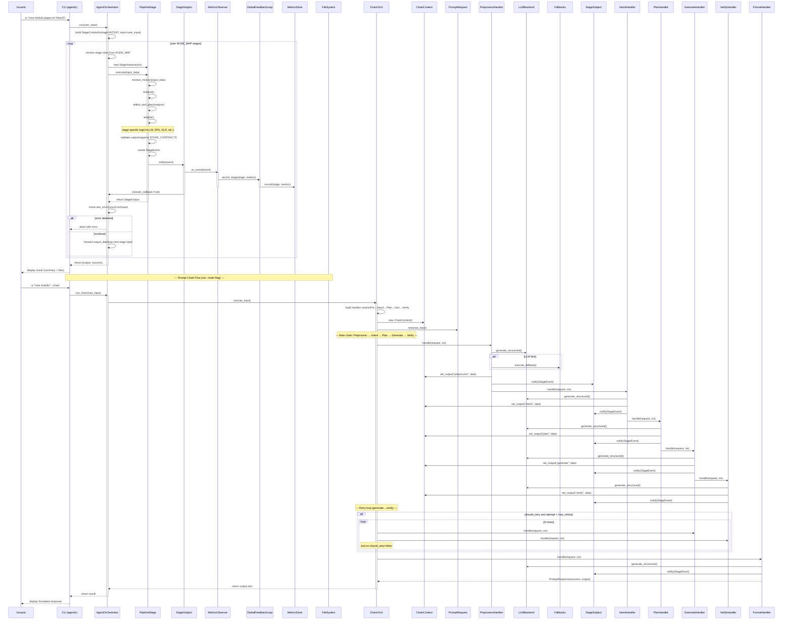

# Diagrama de Secuencia — Pipeline RECPL v2.0+

```mermaid
sequenceDiagram
    participant U as Usuario
    participant CLI as CLI (agentic)
    participant AO as AgentOrchestrator
    participant PS as PipelineStage
    participant Subj as StageSubject
    participant MO as MetricsObserver
    participant FB as GlobalFeedbackLoop
    participant MS as MetricsStore
    participant FS as FileSystem

    U->>CLI: -p "crea modulo pagos en NestJS"
    CLI->>AO: run(user_input)
    activate AO
    AO->>AO: build StageContext\n(stage=INTENT, input=user_input)

    loop over NODE_MAP stages
        AO->>AO: resolve stage class from NODE_MAP
        AO->>PS: new StageInstance(ctx)
        AO->>PS: execute(input_data)
        activate PS

        PS->>PS: receive_mission(input_data)
        PS->>PS: analyze()
        PS->>PS: reflect_and_plan(analysis)
        PS->>PS: act(plan)
        Note over PS: stage-specific logic\n(LLM, DFA, GLR, etc.)

        PS->>PS: validate output\nagainst STAGE_CONTRACTS
        PS->>PS: create StageEvent
        PS->>Subj: notify(event)
        activate Subj
        Subj->>MO: on_event(event)
        activate MO
        MO->>FB: record_stage(stage, metrics)
        activate FB
        FB->>MS: record(stage, metrics)
        deactivate MO
        deactivate FB
        Subj->>AO: (stream_callback if set)
        deactivate Subj

        PS-->>AO: return StageOutput
        deactivate PS

        AO->>AO: check last_error\nvia ErrorGuard
        alt error detected
            AO-->>CLI: abort with error
        else continue
            AO->>AO: forward output_data\nas next stage input
        end
    end

    AO-->>CLI: return {output, success}
    deactivate AO
    CLI-->>U: display result (summary + files)

    Note over CLI,FS: --- Prompt Chain Flow (via --chain flag) ---

    U->>CLI: -p "crea modulo" --chain
    CLI->>AO: run_chain(raw_input)
    activate AO
    AO->>ChainOrch: run(raw_input)
    activate ChainOrch

    ChainOrch->>ChainOrch: build handler chain\nPre→Intent→Plan→Gen→Verify
    ChainOrch->>ChainContext: new ChainContext()
    ChainOrch->>PromptRequest: new(raw_input)

    Note over ChainOrch: --- Main chain: Preprocess → Intent → Plan → Generate → Verify ---
    ChainOrch->>PreprocessHandler: handle(request, ctx)
    PreprocessHandler->>LLMBackend: generate_structured()
    alt LLM fails
        PreprocessHandler->>Fallbacks: execute_fallback()
    end
    PreprocessHandler->>ChainContext: set_output("preprocess", data)
    PreprocessHandler->>StageSubject: notify(StageEvent)
    PreprocessHandler->>IntentHandler: handle(request, ctx)

    IntentHandler->>LLMBackend: generate_structured()
    IntentHandler->>ChainContext: set_output("intent", data)
    IntentHandler->>StageSubject: notify(StageEvent)
    IntentHandler->>PlanHandler: handle(request, ctx)

    PlanHandler->>LLMBackend: generate_structured()
    PlanHandler->>ChainContext: set_output("plan", data)
    PlanHandler->>StageSubject: notify(StageEvent)
    PlanHandler->>GenerateHandler: handle(request, ctx)

    GenerateHandler->>LLMBackend: generate_structured()
    GenerateHandler->>ChainContext: set_output("generate", data)
    GenerateHandler->>StageSubject: notify(StageEvent)
    GenerateHandler->>VerifyHandler: handle(request, ctx)

    VerifyHandler->>LLMBackend: generate_structured()
    VerifyHandler->>ChainContext: set_output("verify", data)
    VerifyHandler->>StageSubject: notify(StageEvent)

    Note over ChainOrch: --- Retry loop (generate→verify) ---
    alt should_retry and attempt < max_retries
        loop N times
            ChainOrch->>GenerateHandler: handle(request, ctx)
            ChainOrch->>VerifyHandler: handle(request, ctx)
            Note over ChainOrch: exit on should_retry=false
        end
    end

    ChainOrch->>FormatHandler: handle(request, ctx)
    FormatHandler->>LLMBackend: generate_structured()
    FormatHandler->>StageSubject: notify(StageEvent)

    FormatHandler-->>ChainOrch: PromptResponse(success, output)

    ChainOrch-->>AO: return output dict
    deactivate ChainOrch
    AO-->>CLI: return result
    deactivate AO
    CLI-->>U: display formatted response
```
