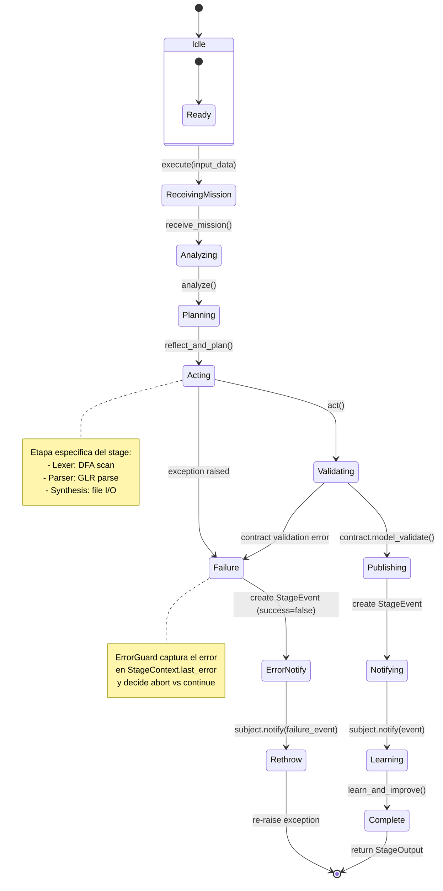
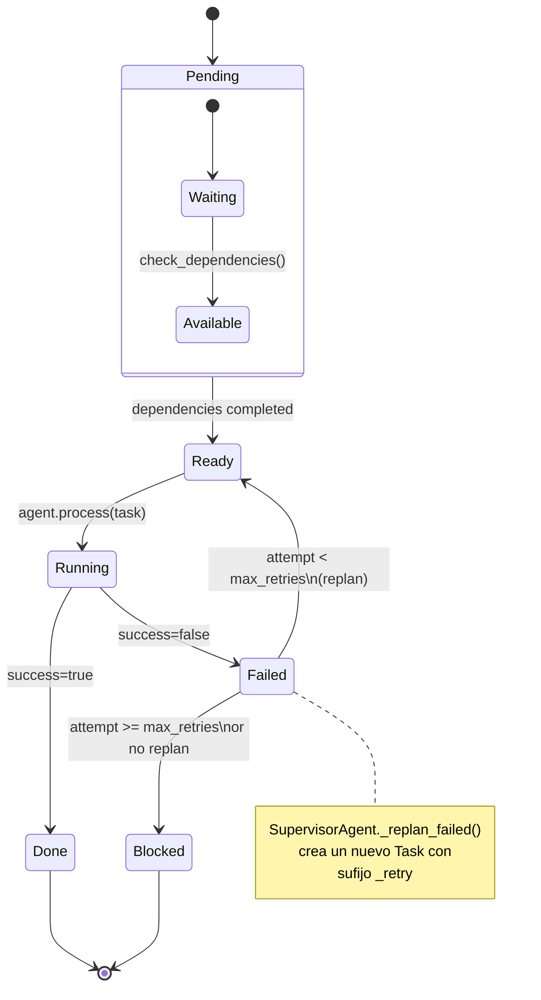
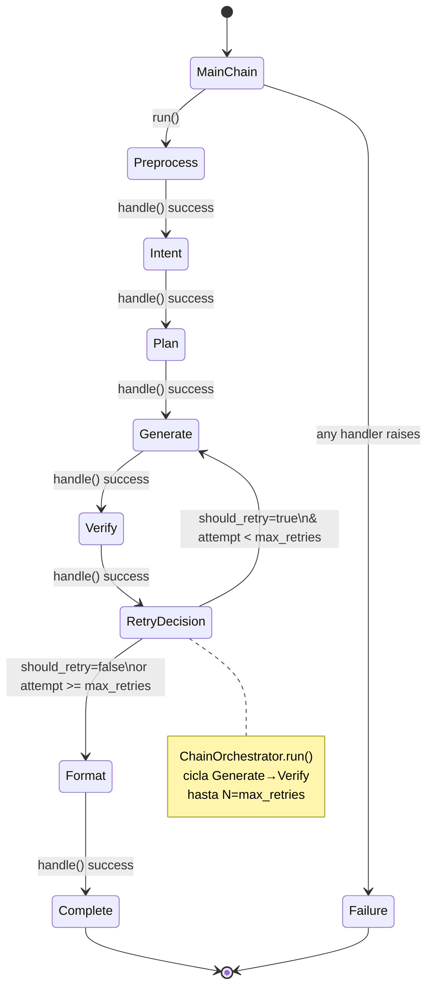
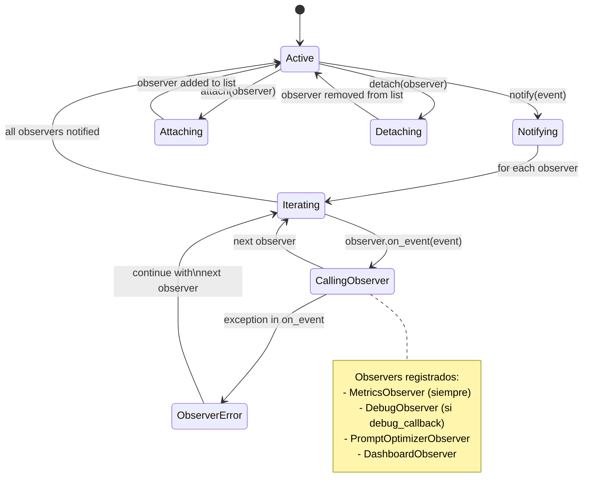
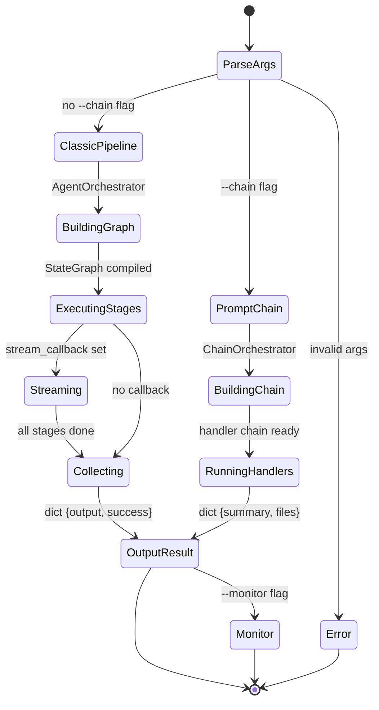

# Diagrama de Máquina de Estados — RECPL Compiler Bot v2.0+

## 1. Ciclo de Vida de PipelineStage

## 2. Ciclo de Vida de Task (Multi-Agent System)

## 3. Estados del Prompt Chain (ChainOrchestrator)

## 4. Estados del StageSubject/Observer

## 5. Estados del Modo de Operacion (CLI)

