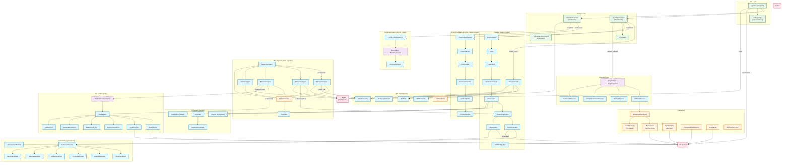

# Diagrama de Componentes — RECPL Compiler Bot v2.0+

```mermaid
graph TB
    %% =========================================================================
    %% STYLES
    %% =========================================================================
    classDef subsystem fill:#e1f5fe,stroke:#0288d1,stroke-width:2px
    classDef external fill:#fce4ec,stroke:#c62828,stroke-width:2px
    classDef core fill:#e8f5e9,stroke:#2e7d32,stroke-width:2px
    classDef data fill:#fff3e0,stroke:#ef6c00,stroke-width:2px
    classDef interface fill:#f3e5f5,stroke:#7b1fa2,stroke-width:2px,stroke-dasharray: 5 5

    %% =========================================================================
    %% EXTERNAL SYSTEMS
    %% =========================================================================
    User("Usuario"):::external
    LLM_API("LLM API\n(OpenAI, etc.)"):::external
    FS("File System"):::external

    %% =========================================================================
    %% CLI / ENTRY POINT
    %% =========================================================================
    subgraph "CLI Layer"
        CLI["agentic (entrypoint)"]:::core
        CLI_Debug["debugger.py\n(pipeline debug)"]:::core
    end

    %% =========================================================================
    %% CORE ORCHESTRATOR
    %% =========================================================================
    subgraph "Orchestration"
        AO["AgentOrchestrator\n(StateGraph)"]:::core
        CO["ChainOrchestrator\n(CoR chain)"]:::core
        PM["PipelineMacroCommand\n(Command)"]:::core
        EG["ErrorGuard"]:::core
    end

    %% =========================================================================
    %% PIPELINE STAGES
    %% =========================================================================
    subgraph "Pipeline Stages (nodes/)"
        direction TB
        PU["PerceptionUnit"]:::subsystem
        PP["Preprocessor"]:::subsystem
        LX["Lexer"]:::subsystem
        PR["ParserGLR"]:::subsystem
        SA["SemanticAnalyzer"]:::subsystem
        IR["IRGenerator"]:::subsystem
        RE["ReasoningEngine"]:::subsystem
        AE["ActionExecutor"]:::subsystem
        UG["UIGenerator"]:::subsystem
        VP["ValidatorPipeline"]:::subsystem
    end

    %% =========================================================================
    %% PROMPT CHAIN HANDLERS
    %% =========================================================================
    subgraph "Prompt Handlers (prompt_chain/prompts/)"
        direction TB
        PH_PRE["PreprocessHandler"]:::subsystem
        PH_INT["IntentHandler"]:::subsystem
        PH_PLN["PlanHandler"]:::subsystem
        PH_GEN["GenerateHandler"]:::subsystem
        PH_VER["VerifyHandler"]:::subsystem
        PH_FMT["FormatHandler"]:::subsystem
    end

    %% =========================================================================
    %% COMMAND PATTERN
    %% =========================================================================
    subgraph "Command Layer (prompt_chain/)"
        direction TB
        CMD_BASE["Command / MacroCommand"]:::interface
        CMD_HIST["CommandHistory"]:::subsystem
        CMD_PROMPT["Prompt*Commands (6)"]:::subsystem
    end

    %% =========================================================================
    %% OBSERVER PATTERN
    %% =========================================================================
    subgraph "Observer Layer"
        direction TB
        OBS_BASE["StageSubject / StageObserver"]:::interface
        OBS_MET["MetricsObserver"]:::subsystem
        OBS_DBG["DebugObserver"]:::subsystem
        OBS_PRO["PromptOptimizerObserver"]:::subsystem
        OBS_DASH["DashboardObserver"]:::subsystem
    end

    %% =========================================================================
    %% NLP SUBSYSTEM
    %% =========================================================================
    subgraph "NLP Pipeline (nlp/)"
        direction TB
        IC["IntentClassifier"]:::subsystem
        NE["NERExtractor"]:::subsystem
        SF["SlotFiller"]:::subsystem
        AD["AmbiguityDetector"]:::subsystem
        EI["EnrichedInput"]:::data
    end

    %% =========================================================================
    %% IR SYSTEM
    %% =========================================================================
    subgraph "IR System (nodes/)"
        direction TB
        IRN["IRNode (Composite)"]:::subsystem
        IRB["IRBuilder"]:::subsystem
        IRS["IRSerializer (Bridge)"]:::subsystem
        DG["DependencyGraph"]:::subsystem
    end

    %% =========================================================================
    %% GENERATORS
    %% =========================================================================
    subgraph "Generators (generators/)"
        direction TB
        GF["GeneratorFactory"]:::subsystem
        RG["ReactGenerator"]:::subsystem
        NG["NestJSGenerator"]:::subsystem
        PG["PrismaGenerator"]:::subsystem
        DG2["DockerGenerator"]:::subsystem
        TG["TailwindGenerator"]:::subsystem
        NXG["NextJSGenerator"]:::subsystem
        UCB["UIComponentBuilder"]:::subsystem
    end

    %% =========================================================================
    %% MULTI-AGENT SYSTEM
    %% =========================================================================
    subgraph "Multi-Agent System (agents/)"
        direction TB
        EB["EventBus"]:::subsystem
        SC["SharedContext"]:::data
        SA_AG["SupervisorAgent"]:::subsystem
        PA["PerceptionAgent"]:::subsystem
        RA["ReasoningAgent"]:::subsystem
        EA["ExecutionAgent"]:::subsystem
        VA["ValidatorAgent"]:::subsystem
    end

    %% =========================================================================
    %% TOOLS
    %% =========================================================================
    subgraph "Tool System (tools/)"
        direction TB
        TR["ToolRegistry"]:::subsystem
        TA["ToolCommand (Adapter)"]:::interface
        RFT["ReadFileTool"]:::subsystem
        WFT["WriteFileTool"]:::subsystem
        RCT["RunCommandTool"]:::subsystem
        SCT["SearchCodeTool"]:::subsystem
        GCT["GenerateCodeTool"]:::subsystem
        AUT["AskUserTool"]:::subsystem
    end

    %% =========================================================================
    %% DATA / STORAGE
    %% =========================================================================
    subgraph "Data Layer"
        direction TB
        MS["MetricsStore\n(SQLite/JSON)"]:::data
        FB["FeedbackLoop\n(file-based)"]:::data
        GFB["GlobalFeedbackLoop"]:::data
        ST["SymbolTable\n(Memento)"]:::data
        MC["ConversationalMemory"]:::data
        LC["LLMCache"]:::data
        AC["ASTCache (LRU)"]:::data
    end

    %% =========================================================================
    %% CONNECTIONS
    %% =========================================================================
    CLI --> AO
    CLI --> CO
    CLI --> CLI_Debug

    AO -->|"NODE_MAP"| PU
    AO -->|"sequential"| PP
    AO --> PP
    PP --> LX
    LX --> PR
    PR --> SA
    SA --> IR
    IR --> RE
    RE --> AE
    RE --> UG
    UG --> VP

    AO --> EG
    AO -->|"stream_callback"| OBS_BASE

    CO -->|"builds chain"| PH_PRE
    PH_PRE --> PH_INT
    PH_INT --> PH_PLN
    PH_PLN --> PH_GEN
    PH_GEN --> PH_VER
    PH_VER --> PH_FMT

    CO -->|"wraps as"| CMD_PROMPT
    CMD_BASE --> CMD_HIST
    CMD_PROMPT --> CMD_BASE

    OBS_BASE --> OBS_MET
    OBS_BASE --> OBS_DBG
    OBS_BASE --> OBS_PRO
    OBS_BASE --> OBS_DASH

    OBS_MET --> GFB
    GFB --> MS
    GFB --> FB

    PU --> IC
    PU --> NE
    PU --> SF
    PU --> AD

    IR --> IRN
    IR --> IRB
    IRB --> DG
    IR --> IRS

    AE --> GF
    GF --> RG
    GF --> NG
    GF --> PG
    GF --> DG2
    GF --> TG
    GF --> NXG
    UG --> UCB

    SA_AG -->|"orchestrates"| PA
    SA_AG --> RA
    SA_AG --> EA
    SA_AG --> VA

    SC --> EB
    SA_AG --> SC
    PA --> SC
    RA --> SC
    EA --> SC
    VA --> SC

    PA -->|"LLM or rule"| IC
    RA -->|"LLM or GoalTree"| RE
    EA -->|"LLM or tools"| TR
    EA -->|"ToolCommand"| TA
    TA --> TR

    TR --> RFT
    TR --> WFT
    TR --> RCT
    TR --> SCT
    TR --> GCT
    TR --> AUT

    CLI -->|"reads/writes"| FS
    AE -->|"writes files"| FS
    RFT --> FS
    WFT --> FS

    CLI -->|"calls"| LLM_API
    CO --> LLM_API
    PU --> LLM_API
    PA --> LLM_API
    RA --> LLM_API
    EA --> LLM_API

    %% =========================================================================
    %% DATABASE STORES
    %% =========================================================================
    MS --> FS
    MC --> FS
    LC --> FS
    ST --> FS
```
