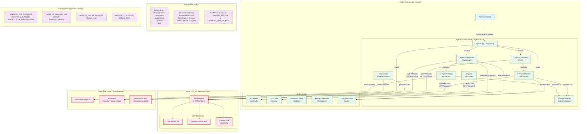

# Diagrama de Despliegue — RECPL Compiler Bot v2.0+

```mermaid
graph TB
    %% =========================================================================
    %% STYLES
    %% =========================================================================
    classDef node fill:#e1f5fe,stroke:#0288d1,stroke-width:2px
    classDef artifact fill:#e8f5e9,stroke:#2e7d32,stroke-width:1px
    classDef external fill:#fce4ec,stroke:#c62828,stroke-width:2px
    classDef comm fill:#f3e5f5,stroke:#7b1fa2,stroke-width:1px,stroke-dasharray: 5 5

    %% =========================================================================
    %% USER MACHINE
    %% =========================================================================
    subgraph "Nodo: Maquina del Usuario"
        direction TB
        Terminal["Terminal / Shell"]:::node

        subgraph "Python Environment (CPython 3.11)"
            direction TB
            CLI["agentic (CLI entrypoint)"]:::artifact
            AO["AgentOrchestrator\n(StateGraph)"]:::artifact
            CO["ChainOrchestrator\n(CoR)"]:::artifact
            Stages["10 PipelineStage\nsubclasses"]:::artifact
            Handlers["6 PromptHandler\nsubclasses"]:::artifact
            Agents["5 Agent\nsubclasses"]:::artifact
            Generators["7 Generator\nimplementations"]:::artifact
            Observers["4 StageObserver\nimplementations"]:::artifact
        end

        subgraph "Local Storage"
            direction TB
            SQLite["SQLite DB\nmetrics.db"]:::artifact
            JSON_FB["JSON Files\nmemory/"]:::artifact
            Gen_Code["Generated Code\nmodules/"]:::artifact
            Prompts["Prompt Templates\n(templates/)"]:::artifact
            LLM_Cache["LLM Response\nCache"]:::artifact
        end
    end

    %% =========================================================================
    %% LLM SERVICE (External)
    %% =========================================================================
    subgraph "Nodo: LLM API Service (Cloud)"
        direction TB
        LLM_Endpoint["API Endpoint\n(HTTPS/REST)"]:::external

        subgraph "LLM Backends"
            direction TB
            GPT4["OpenAI GPT-4o"]:::external
            GPT4Mini["OpenAI GPT-4o-mini"]:::external
            Custom["Custom LLM\n(via config)"]:::external
        end
    end

    %% =========================================================================
    %% FILE SYSTEM (External)
    %% =========================================================================
    subgraph "Nodo: File System (Local/Network)"
        direction TB
        FS_Root["/home/user/projects/"]:::external
        FS_Templates["templates/\n(NestJS, Prisma, React)"]:::external
        FS_Output["output/modules/\n(generated scaffold)"]:::external
    end

    %% =========================================================================
    %% COMMUNICATION PATHS
    %% =========================================================================
    Terminal -->|"python agentic -p 'text'"| CLI

    CLI -->|"invokes"| AO
    CLI -->|"invokes"| CO

    AO -->|"executes"| Stages
    CO -->|"executes"| Handlers

    Stages -->|"publishes to"| Observers
    Handlers -->|"publishes to"| Observers

    AO -->|"LLM API calls\n(HTTPS/JSON)"| LLM_Endpoint
    CO -->|"LLM API calls\n(HTTPS/JSON)"| LLM_Endpoint
    Handlers -->|"LLM API calls\n(HTTPS/JSON)"| LLM_Endpoint
    Agents -->|"LLM API calls\n(HTTPS/JSON)"| LLM_Endpoint

    LLM_Endpoint --> GPT4
    LLM_Endpoint --> GPT4Mini
    LLM_Endpoint --> Custom

    Stages -->|"writes scaffold"| FS_Root
    Generators -->|"generates files"| FS_Output
    Generators -->|"reads templates"| FS_Templates
    CLI -->|"loads"| FS_Templates

    AO -->|"reads/writes metrics"| SQLite
    AO -->|"legacy feedback"| JSON_FB

    CLI -->|"reads"| LLM_Cache
    Handlers -->|"reads/writes"| LLM_Cache

    %% =========================================================================
    %% DEPLOYMENT SPECIFICATIONS
    %% =========================================================================
    subgraph "Deployment Specs"
        direction TB
        Spec1["Python 3.11+
        Dependencies:
        - langgraph
        - pydantic v2
        - openai
        - lark"]:::comm
        Spec2["No server required
        Single-process CLI
        StateGraph in-memory
        Metrics persist to SQLite"]:::comm
        Spec3["LLM API key via env:
        OPENAI_API_KEY
        or AGENTIC_LLM_API_KEY"]:::comm
    end

    %% =========================================================================
    %% ENVIRONMENT VARIABLES
    %% =========================================================================
    subgraph "Configuration (pydantic-settings)"
        direction TB
        ENV_LLM["AGENTIC_LLM_PROVIDER\nAGENTIC_LLM_MODEL\nAGENTIC_LLM_TEMPERATURE"]:::comm
        ENV_MEM["AGENTIC_MEMORY_DIR\n(default: /tmp/recpl_memory)"]:::comm
        ENV_CACHE["AGENTIC_CACHE_ENABLED\n(default: true)"]:::comm
        ENV_LOG["AGENTIC_LOG_LEVEL\n(default: INFO)"]:::comm
    end
```
