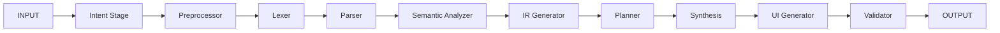

# RECPL Pipeline v2.0

Compilador de lenguaje natural a codigo IR (Intermediate Representation).



## Quick Start

```bash
pip install -e compiler-bot/agentic_pipeline/
./compiler-bot/agentic --prompt "crea un modulo de pagos con NestJS"
```

## Documentacion

- [Onboarding: entender el pipeline](onboarding/01_pipeline.md)
- [API Reference](api/base_stage.md)
- [Indice completo](INDEX.md)
