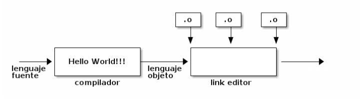
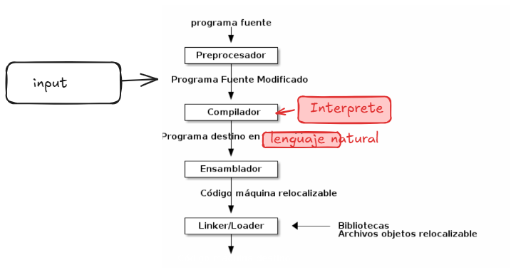

---

You are building un compilador-compilador, un generador de compilador, para un procesador de texto para archivos markdown

# Marco Integral de Proyecto

1. Información General del Proyecto
1.1 Nombre del Proyecto

Nombre provisional: __________________________________________

1.2 Descripción General

Describir el objetivo principal del sistema, visión del producto y propuesta de valor.

Resumen Ejecutivo
Problema que resuelve
Público objetivo
Diferenciadores del sistema
Alcance general
Objetivos de negocio
Objetivos técnicos
2. Visión del Producto
2.1 Objetivos Estratégicos
Objetivo	Descripción	Prioridad
2.2 Público Objetivo
Segmentos de usuarios
Cliente Final
Edad:
Intereses:
Comportamiento:
Necesidades:
Administrador
Responsabilidades:
Necesidades:
Vendedor / Operador
Responsabilidades:
Necesidades:
3. Toma de Requerimientos
3.1 Requerimientos Funcionales
3.2 Requerimientos No Funcionales

4. Análisis del Sistema

4.1 Problema actual

5. Architecture rules

4.2 Solución propuesta

4.3 Factibilidad

5. Arquitectura del Sistema

5.1 Arquitectura general
> Diagrama general: (insertar diagrama ASCII)

5.2 Componentes

Diseño de Base de Datos

6.1 Modelo de base de datos (...)

6.3 Relaciones clave

7. Modelado de Procesos

7.1 Flujo del bot inteligente

7.1 Sistema de diseño

7.2 Formularios clave (Diseño de Entrada)

7.3 Pantallas principales (Diseño de Salida)

8. Elaboración de Prototipos

8.1 Wireframes

8.2 Prototipos funcionales

9. Diseño UX / UI

9.1 Experiencia de usuario

9.2 Diseño de interfaz

- Mobile first, responsive, soporte dark mode, animaciones suaves

10. Stack Tecnológico

10.1 Frontend

10.2 Backend

| Tecnología | Uso |
|---|---|
| Node.js / NestJS | API |
| Python | IA / NLP |
| FastAPI | Servicios IA |

10.3 Base de datos

10.4 DevOps

11. API y Comunicación

11.1 Arquitectura API

- REST API, GraphQL y WebSockets según caso de uso

11.2 Endpoints principales (ejemplos)

13. Jest	Unit Testing
Cypress	E2E
Postman	APIs
14. DevOps y Despliegue
14.1 Infraestructura
Ambientes
Desarrollo
Staging
Producción
Hosting
AWS
DigitalOcean
Google Cloud
Azure
16.2 Pipeline CI/CD
Push código
Ejecutar tests
Build
Deploy automático
Verificación
15. Gestión del Proyecto
15.1 Metodología
Scrum
Kanban
Agile
15.2 Roles
Rol	Responsabilidades
Project Manager	Gestión general
Backend Developer	APIs y lógica
Frontend Developer	UI/UX
AI Engineer	Bot inteligente
DevOps Engineer	Infraestructura
15.3 Roadmap
Fase 1 — Investigación y Diseño
Requerimientos
Arquitectura
Prototipos
Fase 2 — MVP
Autenticación
Catálogo
Carrito
Pedidos
Fase 3 — Bot Inteligente
NLP
Integración IA
Automatización
Fase 4 — Escalabilidad
Optimización
Analytics
Recomendaciones IA
16. Gestión de Riesgos
Riesgo	Impacto	Mitigación
Caída del sistema	Alto	Redundancia
Problemas de pago	Alto	Pasarelas múltiples
Escalabilidad	Medio	Arquitectura modular
17. Métricas y KPIs
KPIs Técni
---

---
Crea un bucle o funcion recursiva de tipo bot con los siguientes requerimientos:
- Establecer reglas de respuestas deterministas para un bot que tenga los siguientes metodos :
read, eval, print, loop.
- Establece Reglas Semanticas, Reglas Sintacticas y Reglas Lexicas basicas de acuerdo a estandares y patrones probados para bots conversaciona Para estos metodos.
Algoritmo:
Input/Lenguaje fuente
preproceso de la entrada <- utilities
lexer -> Tokeniza [READ(scan)][EVAL(act)][PRINT(print)][LOOP(loop)]
tokenizacion <- lexema <- Analizador lexico(reglas sintacticas)
Se captura la entrada mediante un linker o algo parecido 

La finalidad es crear un sistema de procesamiento "(Aho:chap1) Un sistema de procesamiento de lenguaje consiste en varios componentes que funcionan en una cola de procesamiento. Esta cola normalmente se inicia con un preprocesador y finaliza con el link editor o linker:
"

Flujo completo ideal (compilador):
Usuario: "Crea un módulo de pagos en NestJS"
  ↓
compilador compile "Crea un módulo de pagos..."
  ↓ LEX: tokeniza → [READ(scan)][EVAL(act)][PRINT(print)][LOOP(loop)]
  ↓ PARSE: construye AST
  ↓ SEMANTIC: resuelve con perfil + tabla de símbolos
  ↓ (OPCIONAL)SCORE: busca acciones similares en training
  ↓ IR.json: representación intermedia canónica
  ↓ (opcional[ESTABLECER])TRACE: three-address code (trazabilidad)
  ↓ SYNTHESIS: [READ(scan)][EVAL(act)][PRINT(print)][LOOP(loop)] o todas
  ↓ BOT: responde por chat
---

--- 
Escribe 3 agentes en la siguiente ruta /home/john/proyects/proyect0/.opencode/agents. Los agentes seran de tipo orquestador, sigue la siguiente especificación/prompt para crear los agentes : /home/john/proyects/proyect0/docs/008_PRM_BUILD_AGENT_1_0_DRAFT.md. 
# instruciones/descripcion:
## Orquestador1: delega
Contexto: -
1. Dónde(En que proyecto estamos trabajando leer) ubicacion/ruta, ruta de entrada, ruta de salida
2. Tareas : ¿Qué hacer? leer archivo : /home/john/proyects/proyect0/docs/006_PROP_DEV_COMPILER_BOT_1_0_DRAFT.md y /home/john/proyects/proyect0/docs/007_GUIDE_DEV_COMPILER_BOT_1_0_DRAFT.md crear ruta/mapa de ejecucion de lectura para que el agente/programador pueda saber que tareas ejecutar de acuerdo a las especificaciones y su mutua referencia.
3. Orden (Cuando): Evaluar en que orden realizar las las tareas.
4. Quien: (generador de prompt -> Generador de prompt)->Itera 
5. Cómo : Generador de promp : Delega a generador de prompt para saber qué, cómo, cuándo y dónde.
## orquestardor2: delega 
Contexto: Investigacion 
1. Problema:
2. Causa
Instrucciones : Fases delegadas por orquestador 1
Restricciones: -
- Sigue protocolo de AGENT.md
- Devuelveme : 
Resultado de build, 
resutado de test
Resultado de verificaion de endpoints
Resultado de deploy si aplica...
---
## Orquestador 3 : Generador de prompt
Contexto : Generador de prompt
Recibe cómo de orquestador 1
devuelve prompt

Analiza el proyecto y escribe un archivo .md para proponer funcionalidad/mejoras y hacerlo mas completo de acuerdo a las siguientes especificaciones. :/home/john/proyects/proyect0/docs/003_DOC_PROP_DOC_PROCESSOR_1.0_DRAFT.md, /home/john/proyects/proyect0/docs/004_SPEC_DEV_DOC_PROCESSOR_1_0_DRAFT.md evalua la propuesta como una continuacion de /home/john/proyects/proyect0/docs/014_PROP_DEV_COMPILER_BOT_NLP_INTENT_1_0_DRAFT.md
Se espera la siguiente propuesta :
- El bot debera ser capaz de entender y realizar tareas como seguir el siguiente tutorial y realizar las acciones que estan descritas en el, leer archivo: /home/john/proyects/proyect0/misc/tutorial.md.

Let me write the market analysis report following the naming convention.

publico objetivo :
Manufactura electronica
de esos usarian una herramienta tipo compiler-compiler = 15,000
sinergia
como envolverias el "tutorial" proyecto descrito en el siguiente archivo /home/john/proyects/proyect0/template/tutorial.md en un marco generico para inicializar, configurar, planeara, codificar, etc..., un proyecto de desarrollo de software. Escribe un archivo .md con tu respuesta. Utiliza tu conocimiento y estadares de la industria para escribir tu respuesta.
lifecycle